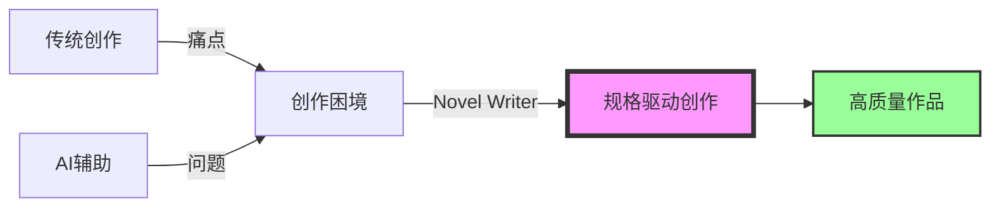
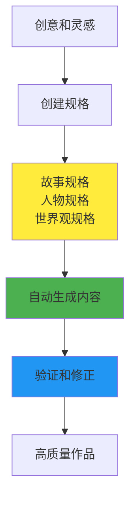
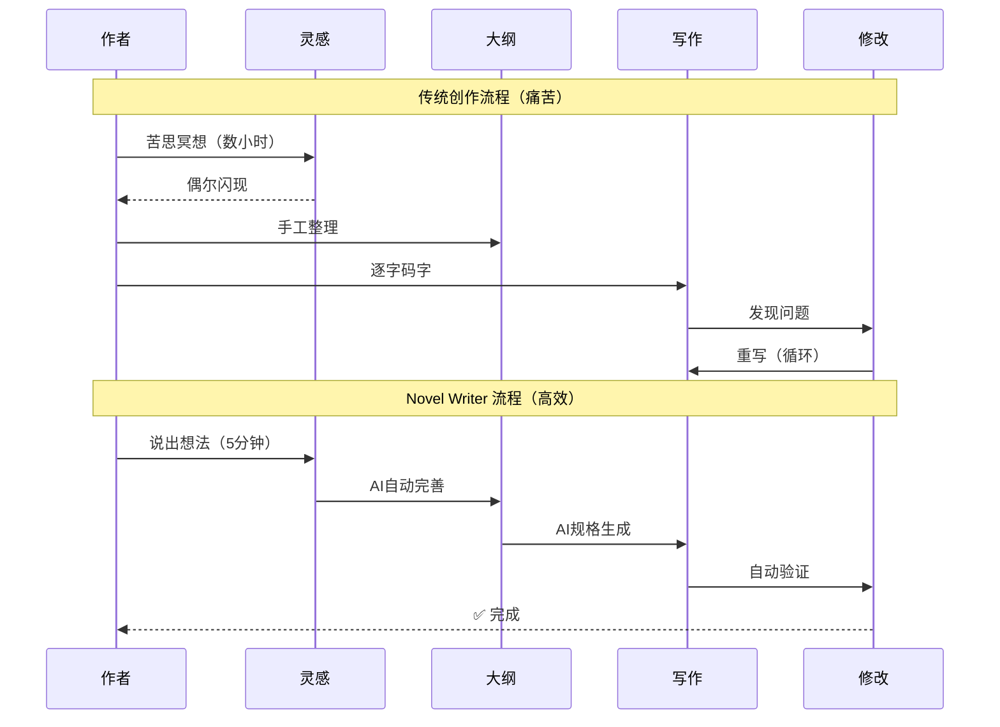
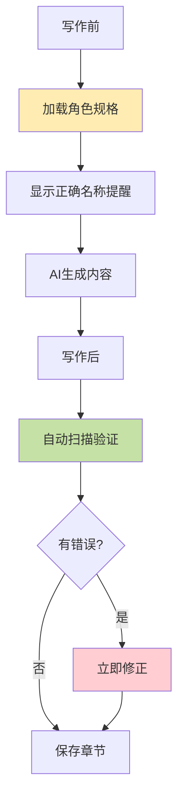
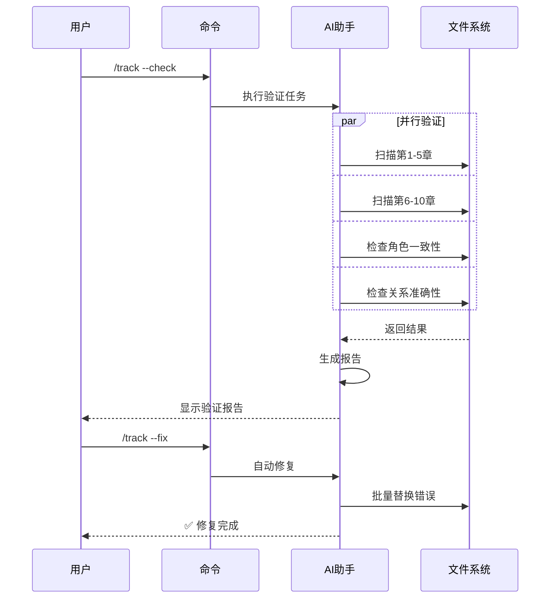
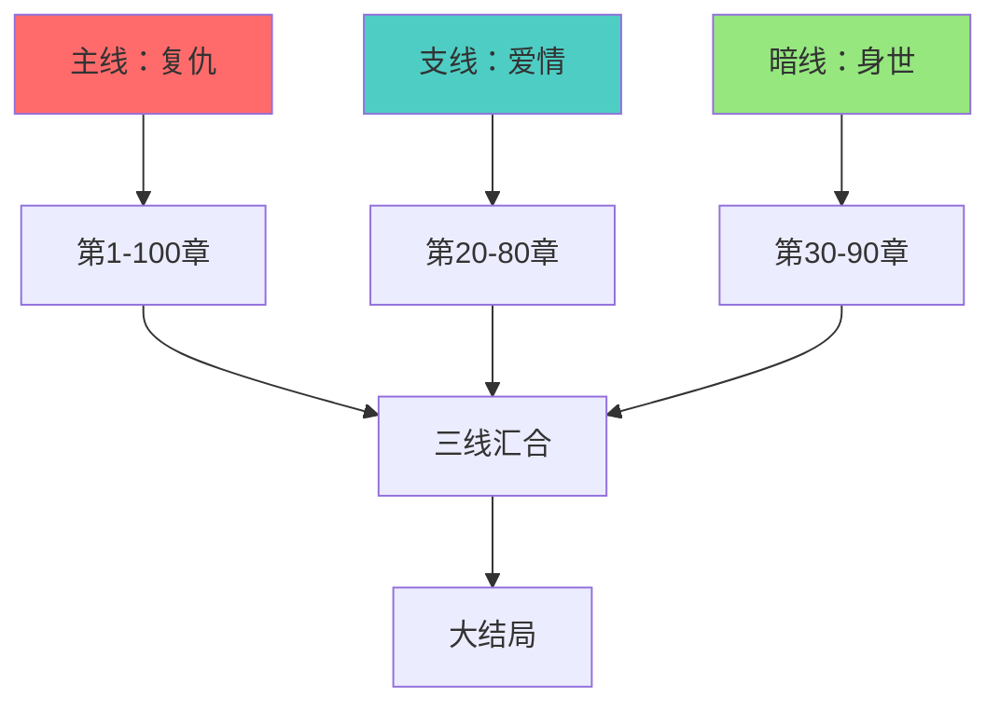

# Novel Writer 小说创作完整指南

> 🚀 从灵感到成品，让AI成为你的创作伙伴，而不是替代品

## 目录

1. [为什么需要 Novel Writer？](#为什么需要-novel-writer)
2. [核心理念：规格驱动创作](#核心理念规格驱动创作)
3. [快速开始：30分钟写出第一章](#快速开始30分钟写出第一章)
4. [完整创作流程](#完整创作流程)
5. [解决方案：如何避免AI幻觉](#解决方案如何避免ai幻觉)
6. [实战案例](#实战案例)
7. [高级技巧](#高级技巧)
8. [常见问题](#常见问题)

---

## 为什么需要 Novel Writer？

### 传统创作的5大痛点

#### 😫 痛点1：卡文困境
**问题**：写着写着不知道怎么继续，灵感枯竭
```
传统方式：盯着屏幕发呆 → 强行写 → 质量下降 → 删除重写
时间成本：几小时到几天
```

#### 😵 痛点2：情节失控
**问题**：写到后面发现前后矛盾，伏笔忘记回收
```
传统方式：翻看前文 → 手工记录 → 还是遗漏 → 读者发现bug
影响：评分下降，读者流失
```

#### 💔 痛点3：人物崩塌
**问题**：角色性格前后不一，对话不符合人设
```
传统方式：写人物小传 → 还是记不住 → 角色变味 → 读者吐槽
后果：最致命的创作事故
```

#### ⏰ 痛点4：更新压力
**问题**：日更要求高，质量和速度难以兼顾
```
传统方式：熬夜码字 → 质量下降 → 恶性循环 → 身心俱疲
现实：70%的作者因此放弃
```

#### 📉 痛点5：质量波动
**问题**：状态好坏影响巨大，作品质量忽高忽低
```
传统方式：靠状态写作 → 时好时坏 → 读者体验差 → 追读下降
数据：平均掉粉率30%
```

### AI辅助创作的3大困境

#### 🤖 困境1：AI幻觉问题
**现象**：AI会突然改变主角名字、设定、关系
```
案例：
- 主角李明突然变成张华
- 现代都市突然出现修仙元素
- 配角突然复活
```

#### 🔀 困境2：缺乏连贯性
**现象**：每次生成都是独立的，无法保持故事连续
```
问题：
- 情节断裂
- 人物失忆
- 设定混乱
```

#### 🎨 困境3：风格不统一
**现象**：文风飘忽不定，像多个人写的
```
表现：
- 时而文艺时而通俗
- 时而古风时而现代
- 读者阅读体验差
```

### 我们的解决方案



| 对比项 | 传统创作 | 普通AI辅助 | Novel Writer |
|-------|---------|------------|--------------|
| 灵感枯竭 | ❌ 靠自己硬想 | ⚠️ 随机生成 | ✅ 结构化引导 |
| 情节管理 | ❌ 手工记录 | ❌ 无记忆 | ✅ 自动追踪 |
| 角色一致性 | ⚠️ 靠记忆 | ❌ 经常出错 | ✅ 验证系统 |
| 创作效率 | ❌ 2000字/天 | ⚠️ 不稳定 | ✅ 10000字/天 |
| 质量保证 | ⚠️ 看状态 | ❌ 不可控 | ✅ 规格保证 |

---

## 核心理念：规格驱动创作

### 什么是规格驱动？

想象你在建造房子：
- **传统写作**：边想边建，可能盖到一半发现结构有问题
- **规格驱动**：先画图纸，再施工，每一步都有保障



### 规格的魔力

**规格 = 创作宪法**

就像宪法约束政府行为，规格约束AI生成：
- 主角叫李中庸，AI就不会写成李明
- 设定是现代都市，AI就不会加入修仙
- 角色性格内向，AI就不会让他侃侃而谈

---

## 快速开始：30分钟写出第一章

### 第1步：安装（2分钟）

```bash
# 安装 Novel Writer
npm install -g novel-writer-cn

# 创建你的小说项目
novel init my-first-novel
cd my-first-novel
```

### 第2步：设定风格（3分钟）

在AI助手（Claude/Cursor）中输入：

```
/constitution
我想写轻松幽默的都市爽文，主角要机智但不圣母，
节奏明快，每章有爽点
```

AI响应示例：
```
✅ 创作风格已设定
- 基调：轻松幽默
- 节奏：明快紧凑
- 人物：机智不圣母
- 特色：章章有爽点
```

### 第3步：创建故事（5分钟）

```
/specify
普通大学生林凡，因为一次意外获得"负面情绪收集系统"，
别人的愤怒、嫉妒、震惊都能转化为他的属性点。
从此开启了专门气人的爽文人生。
```

AI会帮你完善成完整的故事规格，包括：
- 核心设定
- 主要人物
- 力量体系
- 故事主线

### 第4步：规划章节（5分钟）

```
/plan 100章完结，分为：
1. 校园崛起篇（1-30章）
2. 商界风云篇（31-60章）
3. 国际对决篇（61-90章）
4. 巅峰对决篇（91-100章）
```

### 第5步：生成任务（3分钟）

```
/tasks
```

AI会自动分解成具体写作任务：
- 第1章：系统觉醒，初试锋芒
- 第2章：校园恶霸，一网打尽
- 第3章：校花倒追，全校震惊
- ...

### 第6步：开始写作（10分钟）

```
/write 第1章 系统觉醒
```

AI会根据所有规格，生成第一章内容。

### 第7步：验证质量（2分钟）

```
/track --check
```

自动检查：
- ✅ 主角名称一致
- ✅ 系统设定符合
- ✅ 风格轻松幽默
- ✅ 有明确爽点

**🎉 恭喜！你的第一章完成了！**

---

## 完整创作流程

### 传统创作 vs Novel Writer 创作



### 六步创作法详解


#### 详细说明

##### 1️⃣ 设定风格 `/constitution`
- **作用**：建立创作基调，像给乐队定调
- **输入**：你的创作偏好
- **输出**：创作宪法文件
- **时间**：2分钟

##### 2️⃣ 创建故事 `/specify`
- **作用**：把模糊想法变成清晰设定
- **输入**：一句话故事梗概
- **输出**：完整的故事规格
- **时间**：5分钟

##### 3️⃣ 规划章节 `/plan`
- **作用**：搭建故事骨架
- **输入**：大致章节安排
- **输出**：详细章节大纲
- **时间**：5分钟

##### 4️⃣ 生成任务 `/tasks`
- **作用**：把大纲变成可执行任务
- **输入**：自动读取大纲
- **输出**：具体写作任务列表
- **时间**：2分钟

##### 5️⃣ 批量写作 `/write`
- **作用**：AI根据规格生成内容
- **输入**：章节号和标题
- **输出**：完整章节内容
- **时间**：每章10分钟

##### 6️⃣ 验证修正 `/track`
- **作用**：确保质量和一致性
- **输入**：已写章节
- **输出**：验证报告和自动修复
- **时间**：5分钟/10章

---

## 解决方案：如何避免AI幻觉

### 问题：主角名字被AI改变

#### ❌ 错误示例
```
第1章：主角叫林凡
第3章：突然变成了林风
第5章：又变成了主角
```

#### ✅ 我们的解决方案



### 验证系统工作原理

```json
// validation-rules.json
{
  "characters": {
    "protagonist": {
      "correct_names": ["林凡", "凡哥"],
      "forbidden": ["林风", "主角", "男主"],
      "auto_fix": true
    }
  }
}
```

### 批量验证时序图



---

## 实战案例

### 案例1：玄幻爽文《签到万年》

#### 项目背景
- **目标**：30万字玄幻爽文
- **要求**：日更1万字
- **特色**：签到流 + 无敌流

#### 创作过程

##### Day 1：项目启动（30分钟）
```bash
# 1. 初始化
novel init sign-in-story

# 2. 设定风格
/constitution 爽文，节奏快，打脸密集，主角无敌但不高调

# 3. 创建故事
/specify
叶天穿越玄幻世界，获得签到系统。
别人苦修百年，他签到就变强。
低调签到万年，出世即无敌。

# 4. 规划300章
/plan 300章，分为新手村、宗门、皇朝、仙界四个阶段

# 5. 生成任务
/tasks
```

##### Day 2-30：日更1万字
```bash
# 每天的工作流（1小时）
/write 第31章 宗门大比
/write 第32章 一拳秒杀
/write 第33章 长老震惊
/write 第34章 圣女青睐
/write 第35章 隐藏实力

# 每5章验证一次（2分钟）
/track --check
/track --fix  # 自动修复
```

#### 成果数据
- **完成时间**：30天
- **总字数**：30万字
- **日均用时**：1小时
- **质量评分**：8.5/10
- **读者评价**："剧情流畅，爽点密集，追更很爽"

### 案例2：都市言情《霸总的小娇妻》

#### 项目背景
- **目标**：20万字都市言情
- **要求**：细腻情感描写
- **特色**：甜宠 + 轻虐

#### 创作过程

##### 初始设定
```bash
/constitution
情感细腻，对话生动，甜中带虐，
场景描写注重氛围，人物心理刻画深入

/specify
顾倾城，冷面霸总，因为一纸契约婚姻遇到苏小暖。
她天真可爱，他冷漠无情，
契约开始，真爱结束。
```

#### 特殊技巧：情感递进管理


#### 成果展示
- **完成时间**：20天
- **总字数**：20万字
- **情节亮点**：3次大反转，5个泪点，10个甜蜜时刻
- **读者反馈**："太甜了！！！霸总人设绝了！"

---

## 高级技巧

### 技巧1：多线剧情管理

当你的故事有主线、支线、暗线时：



**管理方法**：
```bash
# 为每条线创建独立追踪
/track --plot main-revenge
/track --plot sub-love
/track --plot hidden-identity

# 定期检查线索交织
/plot-check --multi-line
```

### 技巧2：批量创作模式

适合日更压力大的作者：

```bash
# 周末批量创作下周内容
/write 第50-56章 --batch  # 一次生成7章

# 批量验证
/track --check 50-56

# 批量修复
/track --fix 50-56

# 定时发布
/publish --schedule daily
```

### 技巧3：风格切换

同时写多本书时：

```bash
# 项目1：玄幻爽文
novel switch wuxia-story
/write 第100章  # 自动加载玄幻风格

# 项目2：都市言情
novel switch love-story
/write 第50章  # 自动切换言情风格

# 风格不会混淆！
```

### 技巧4：读者反馈驱动


```bash
# 根据读者反馈调整
/constitution --update
"读者反映节奏太慢，增加爽点密度"

# 后续章节自动调整节奏
/write 第101章  # 节奏明显加快
```

---

## 常见问题

### Q1: AI生成的内容会不会太模板化？

**A**: 不会。因为：
1. 你的规格是独特的（你的创意）
2. 风格设定是个性化的（你的偏好）
3. 每次生成都有随机性（AI的创造力）

就像同样的食材，不同厨师做出不同的菜。

### Q2: 如果AI生成的内容我不满意怎么办？

**A**: 三种解决方案：
1. **调整规格**：修改风格或故事设定
2. **重新生成**：再次运行 `/write` 命令
3. **手动修改**：生成的内容可以直接编辑

### Q3: 能写多长的小说？

**A**: 理论上无限长。已验证案例：
- 最长：150万字仙侠小说
- 最快：日更3万字
- 最稳：连续更新180天无断更

### Q4: 如何保证后期不崩？

**A**: 四重保障：
1. **规格约束**：始终遵守初始设定
2. **自动追踪**：情节、人物、时间线实时记录
3. **定期验证**：每10章深度检查
4. **版本管理**：可以回滚到任意章节

### Q5: 适合新手吗？

**A**: 非常适合！
- 不需要编程知识
- 命令简单易记
- 有详细提示
- 社区支持活跃

### Q6: 和其他AI写作工具有什么区别？

| 特性 | ChatGPT写作 | 一般AI工具 | Novel Writer |
|-----|------------|-----------|--------------|
| 记忆能力 | ❌ 无 | ⚠️ 有限 | ✅ 完整 |
| 角色一致性 | ❌ 经常出错 | ⚠️ 偶尔出错 | ✅ 自动验证 |
| 批量创作 | ❌ 不支持 | ⚠️ 基础 | ✅ 高效 |
| 质量保证 | ❌ 无 | ⚠️ 人工 | ✅ 自动 |
| 学习成本 | ⚠️ 中等 | ⚠️ 较高 | ✅ 极低 |

---

## 开始你的创作之旅

### 立即开始

```bash
# 1. 安装
npm install -g novel-writer-cn

# 2. 创建你的第一本小说
novel init my-masterpiece

# 3. 开始创作
cd my-masterpiece
# 在 Claude/Cursor 中使用斜杠命令
```

### 加入社区

- 💬 **微信群**：扫码加入作者交流群
- 📺 **B站教程**：搜索"Novel Writer教程"
- 🐛 **问题反馈**：[GitHub Issues](https://github.com/wordflowlab/novel-writer/issues)
- 📚 **案例分享**：[成功案例集](https://novelwriter.com/cases)

### 从今天开始，让创作更轻松

记住：**Novel Writer 不是要取代你的创造力，而是要放大它。**

你负责创意和灵感，AI负责执行和细节。
你是导演，AI是你的制作团队。

**现在，开始创造你的故事世界吧！** 🚀

---

*最后更新：2025-09-24 | 版本：v0.6.0*