# Novel Writer 插件中心 PRD

## 1. 产品概述

### 1.1 产品名称
**Novel Writer Plugin System** - 小说创作工具插件系统

### 1.2 产品定位
Novel Writer 的轻量级插件系统，通过模块化扩展机制，让用户按需添加功能，保持核心工具精简高效。插件系统深度集成到现有的命令架构中，确保插件命令与核心命令具有完全一致的使用体验。

### 1.3 设计理念
- **简单为主**：保持核心功能简洁，复杂功能通过插件提供
- **可选增强**：用户按需选择功能扩展
- **无缝集成**：插件命令自动注入到 AI 助手的命令目录
- **专家支持**：插件可提供专家模式深度指导
- **借鉴精华**：参考 BMAD 的模块化思想，但保持轻量级

### 1.4 目标用户
- **进阶作者**：需要翻译、分析等高级功能
- **专业团队**：需要定制化工作流
- **插件开发者**：希望扩展 Novel Writer 功能

## 2. 系统架构

### 2.1 插件系统架构图

```
┌─────────────────────────────────────────────────┐
│              Novel Writer Core                    │
│                                                   │
│  ┌──────────────────────────────────────────┐   │
│  │         Plugin Manager                     │   │
│  │  ┌────────┬────────┬────────────────┐    │   │
│  │  │Registry│ Loader │ Command Injector│    │   │
│  │  └────────┴────────┴────────────────┘    │   │
│  └──────────────────────────────────────────┘   │
│                                                   │
│  ┌──────────────────────────────────────────┐   │
│  │         Command System                     │   │
│  │  ┌─────────────┬──────────────────┐      │   │
│  │  │ Core Commands│ Plugin Commands  │      │   │
│  │  └─────────────┴──────────────────┘      │   │
│  └──────────────────────────────────────────┘   │
└─────────────────────────────────────────────────┘
                         ↓
┌─────────────────────────────────────────────────┐
│           AI Platform Integration                │
│  ┌──────┬──────┬──────┬──────┬──────────┐     │
│  │Claude│Cursor│Gemini│Windsurf│  ...     │     │
│  └──────┴──────┴──────┴──────┴──────────┘     │
└─────────────────────────────────────────────────┘
```

### 2.2 插件生命周期

```mermaid
graph LR
    A[发现插件] --> B[安装插件]
    B --> C[注册命令]
    C --> D[生成AI命令文件]
    D --> E[插件就绪]
    E --> F[使用插件]
    F --> G[更新/卸载]
```



### 2.3 文件结构（实际实现）

```bash
novel-project/
├── plugins/                         # 插件目录
│   └── [plugin-name]/              # 具体插件
│       ├── config.yaml             # 插件配置
│       ├── commands/               # 插件命令
│       │   └── *.md
│       └── experts/                # 插件专家（可选）
│           └── *.md
├── experts/                         # 专家模式目录
│   ├── core/                       # 核心专家
│   │   ├── plot.md                # 剧情结构专家
│   │   ├── character.md           # 人物塑造专家
│   │   ├── world.md               # 世界观设计专家
│   │   └── style.md               # 文风语言专家
│   └── plugins/                    # 插件专家
│       └── [plugin-name]/
│           └── *.md
├── templates/commands/              # 命令模板
│   ├── *.md                       # 核心命令
│   └── expert.md                  # 专家命令
└── .claude/commands/               # AI 命令目录
    ├── *.md                        # 核心命令
    ├── expert.md                   # 专家命令
    └── plugin-*.md                 # 插件命令
```

## 3. 功能需求

### 3.1 插件管理 CLI

#### 3.1.1 实现的插件管理命令
```bash
novel plugins                        # 显示插件帮助
novel plugins list                   # 列出已安装插件
novel plugins:list                   # 同上（子命令格式）
novel plugins add <name>             # 安装插件
novel plugins:add <name>             # 同上（子命令格式）
novel plugins remove <name>          # 移除插件
novel plugins:remove <name>          # 同上（子命令格式）
```

#### 3.1.2 初始化时的插件支持
```bash
novel init my-novel --plugins translate       # 预装翻译插件
novel init my-novel --with-experts           # 包含专家模式
novel init my-novel --with-experts --plugins translate  # 两者都要
```

### 3.2 插件注册表

#### 3.2.1 注册表结构
```json
{
  "version": "1.0.0",
  "plugins": {
    "translate": {
      "name": "translate",
      "displayName": "翻译出海插件",
      "description": "中文小说英文翻译和本地化",
      "version": "1.0.0",
      "author": "Novel Writer Team",
      "repository": "https://github.com/novelwriter/plugin-translate",
      "commands": [
        "translate",
        "translate-verify",
        "translate-glossary",
        "translate-batch"
      ],
      "dependencies": {
        "novel-writer": ">=0.5.0"
      }
    },
    "analyzer": {
      "name": "analyzer",
      "displayName": "作品分析插件",
      "description": "分析和拆解优秀作品",
      "version": "1.0.0",
      "commands": [
        "analyze",
        "analyze-structure",
        "analyze-style"
      ]
    }
  }
}
```

#### 3.2.2 实际插件配置 (config.yaml)
```yaml
name: novel-translate
version: 1.0.0
description: 中英文小说翻译与本地化插件
author: Novel Writer Team
type: feature
license: MIT

# 插件提供的命令
commands:
  - id: translate
    file: commands/translate.md
    description: 执行专业的中英文翻译流程
  - id: polish
    file: commands/polish.md
    description: 优化英文表达和语言润色

# 插件提供的专家模式
experts:
  - id: translate
    file: experts/translate.md
    title: 翻译本地化专家
    description: 提供深度的翻译策略和文化适配建议

# 插件配置
settings:
  defaultPlatform: general
  platforms:
    - general
    - reddit
    - medium
    - wattpad

# 依赖要求
dependencies:
  core: ">=0.5.0"
```

### 3.3 命令注入系统

#### 3.3.1 命令注入流程
1. **读取插件命令模板**：从 `.specify/plugins/[name]/commands/` 读取
2. **复制到模板目录**：链接到 `templates/commands/plugins/[name]/`
3. **触发重新生成**：运行内部的命令生成逻辑
4. **更新AI命令目录**：生成到 `.claude/commands/`、`.cursor/commands/` 等

#### 3.3.2 命令命名规范
- 核心命令：`style.md`、`story.md` 等
- 插件命令：`[plugin]-[command].md`
  - 例如：`translate-verify.md`、`analyzer-structure.md`

#### 3.3.3 自动更新机制
```typescript
class CommandInjector {
  async injectPluginCommands(pluginName: string): Promise<void> {
    const plugin = await this.loadPlugin(pluginName);

    // 1. 复制命令模板
    for (const command of plugin.commands) {
      const source = path.join(plugin.path, 'commands', command.template);
      const target = path.join(projectPath, 'templates/commands/plugins', pluginName, command.name + '.md');
      await fs.copy(source, target);
    }

    // 2. 重新生成AI命令文件
    await this.regenerateAICommands();
  }

  async regenerateAICommands(): Promise<void> {
    // 读取所有命令模板（核心 + 插件）
    const coreCommands = await this.loadCoreCommands();
    const pluginCommands = await this.loadPluginCommands();
    const allCommands = [...coreCommands, ...pluginCommands];

    // 为每个AI平台生成命令文件
    for (const platform of ['claude', 'cursor', 'gemini', 'windsurf']) {
      await this.generateCommandsForPlatform(platform, allCommands);
    }
  }
}
```

### 3.4 实际插件实现

#### 3.4.1 插件管理器 (src/plugins/manager.ts)
```typescript
export class PluginManager {
  private pluginsDir: string
  private commandsDir: string
  private expertsDir: string

  constructor(projectRoot: string) {
    this.pluginsDir = path.join(projectRoot, 'plugins')
    this.commandsDir = path.join(projectRoot, '.claude', 'commands')
    this.expertsDir = path.join(projectRoot, 'experts')
  }

  async loadPlugins(): Promise<void>
  async listPlugins(): Promise<PluginConfig[]>
  async installPlugin(name: string, source?: string): Promise<void>
  async removePlugin(name: string): Promise<void>

  private async injectCommands(plugin: string, commands: any[]): Promise<void>
  private async registerExperts(plugin: string, experts: any[]): Promise<void>
}

interface PluginConfig {
  name: string
  version: string
  description: string
  type: 'feature' | 'expert' | 'workflow'
  commands?: Array<{
    id: string
    file: string
    description: string
  }>
  experts?: Array<{
    id: string
    file: string
    title: string
    description: string
  }>
  dependencies?: {
    core: string
  }
}
```

#### 3.4.2 插件开发模板
```bash
novel plugin create my-plugin        # 创建插件模板
```

生成的模板结构：
```
my-plugin/
├── package.json
├── index.js                        # 插件入口
├── commands/                       # 命令模板
│   └── my-command.md
├── scripts/                        # 执行脚本
│   ├── bash/
│   └── powershell/
├── lib/                           # 插件逻辑
└── test/                          # 测试文件
```

### 3.5 专家模式集成

#### 3.5.1 核心专家
插件系统与专家模式深度集成：
- **plot** - 剧情结构专家
- **character** - 人物塑造专家
- **world** - 世界观设计专家
- **style** - 文风语言专家

#### 3.5.2 插件专家
插件可以提供自己的专家：
- **translate** 插件 → 翻译本地化专家
- 未来插件可添加更多专业领域专家

#### 3.5.3 专家模式使用
```bash
/expert              # 列出所有可用专家（核心+插件）
/expert plot         # 激活剧情结构专家
/expert translate    # 激活翻译专家（来自插件）
```

## 4. 技术实现

### 4.1 插件加载器

```typescript
class PluginLoader {
  private plugins: Map<string, NovelWriterPlugin> = new Map();

  async loadPlugin(name: string): Promise<NovelWriterPlugin> {
    const pluginPath = path.join(PLUGINS_DIR, name);
    const packageJson = await fs.readJson(path.join(pluginPath, 'package.json'));

    // 验证插件
    this.validatePlugin(packageJson);

    // 加载插件
    const plugin = require(pluginPath);

    // 初始化
    if (plugin.onInstall) {
      await plugin.onInstall();
    }

    this.plugins.set(name, plugin);
    return plugin;
  }

  private validatePlugin(packageJson: any): void {
    // 检查必要字段
    if (!packageJson.novelWriter) {
      throw new Error('Not a valid Novel Writer plugin');
    }

    // 检查版本兼容性
    const requiredVersion = packageJson.novelWriter.dependencies?.['novel-writer'];
    if (!this.checkVersionCompatibility(requiredVersion)) {
      throw new Error(`Plugin requires Novel Writer ${requiredVersion}`);
    }
  }
}
```

### 4.2 命令冲突处理

```typescript
class CommandRegistry {
  private commands: Map<string, CommandSource> = new Map();

  registerCommand(name: string, source: CommandSource): void {
    if (this.commands.has(name)) {
      // 处理命令冲突
      const existing = this.commands.get(name);
      if (existing.type === 'core') {
        throw new Error(`Cannot override core command: ${name}`);
      }

      // 插件命令冲突，使用命名空间
      name = `${source.plugin}-${name}`;
    }

    this.commands.set(name, source);
  }
}
```

### 4.3 配置管理

```typescript
class PluginConfigManager {
  async getConfig(pluginName: string): Promise<any> {
    const configPath = path.join(PLUGINS_DIR, pluginName, 'config.json');
    const defaultConfig = await this.getDefaultConfig(pluginName);
    const userConfig = await fs.readJson(configPath).catch(() => ({}));

    return { ...defaultConfig, ...userConfig };
  }

  async setConfig(pluginName: string, key: string, value: any): Promise<void> {
    const configPath = path.join(PLUGINS_DIR, pluginName, 'config.json');
    const config = await this.getConfig(pluginName);

    // 使用 lodash.set 设置嵌套属性
    _.set(config, key, value);

    await fs.writeJson(configPath, config, { spaces: 2 });
  }
}
```

## 5. 用户体验

### 5.1 安装体验

```bash
$ novel plugins add translate
⠋ 正在安装插件 translate...
✔ 插件 translate 安装成功！

翻译插件已安装成功！

可用命令：
- /translate: 执行翻译流程
- /polish: 英文润色
- /expert translate: 进入翻译专家模式

使用 /translate 开始翻译您的作品。
```

### 5.2 使用体验

在 Claude Code 中：
```
用户：/translate
AI：识别到翻译命令，开始执行翻译流程...
```

### 5.3 列出插件

```bash
$ novel plugins list

已安装的插件:

  novel-translate (v1.0.0)
    中英文小说翻译与本地化插件
    命令: /translate, /polish
    专家: 翻译本地化专家
```

## 6. 安全性考虑

### 6.1 插件沙箱
- 限制文件系统访问
- 限制网络请求
- 限制系统命令执行

### 6.2 权限管理
```json
{
  "permissions": {
    "fileSystem": {
      "read": ["stories/**", "chapters/**"],
      "write": ["translation/**"]
    },
    "network": ["api.deepl.com"],
    "commands": ["git", "npm"]
  }
}
```

### 6.3 插件审核
- 代码静态分析
- 恶意行为检测
- 社区举报机制

## 7. 性能优化

### 7.1 延迟加载
- 插件按需加载，不影响启动速度
- 命令首次使用时才初始化插件

### 7.2 缓存机制
- 插件元信息缓存
- 命令模板缓存
- 配置缓存

### 7.3 并行处理
- 多插件并行安装
- 命令文件并行生成

## 8. 测试计划

### 8.1 单元测试
- [ ] 插件加载器测试
- [ ] 命令注入系统测试
- [ ] 配置管理测试
- [ ] 版本兼容性测试

### 8.2 集成测试
- [ ] 插件安装流程测试
- [ ] 命令执行测试
- [ ] 多插件协同测试
- [ ] AI平台集成测试

### 8.3 性能测试
- [ ] 插件加载性能
- [ ] 命令执行性能
- [ ] 大量插件场景

## 9. 实现状态

### 已实现功能 ✅
- 插件管理器 (PluginManager)
- 命令注入系统
- CLI 插件管理命令
- 专家模式集成
- 翻译插件示例
- 插件配置管理

### 计划功能 📋
- 插件市场
- 远程插件安装
- 插件版本管理
- 更多官方插件

## 10. 成功指标

### 10.1 技术指标
- 插件加载时间 < 100ms
- 命令注入时间 < 500ms
- 插件崩溃率 < 0.1%

### 10.2 用户指标
- 插件平均安装数 > 2个/用户
- 插件使用率 > 60%
- 插件满意度 > 4.5/5

### 10.3 生态指标
- 官方插件数量 > 10个
- 第三方插件数量 > 20个
- 活跃开发者 > 50人
