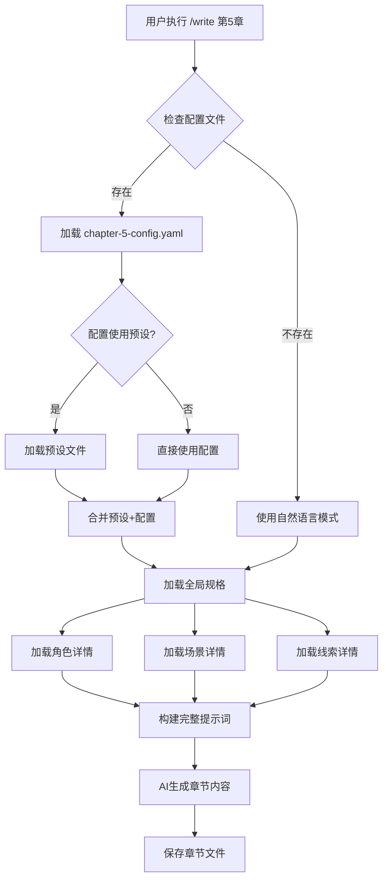

# 章节配置系统 PRD

## 文档信息

- **产品名称**: 章节配置系统 (Chapter Configuration System)
- **版本**: v1.0.0
- **创建日期**: 2025-10-14
- **负责人**: Novel Writer Team
- **状态**: 设计阶段

---

## 一、背景与问题分析

### 1.1 现状分析

**novel-writer-cn 当前架构**：

```
全局规格系统（✅ 完善）：
├── memory/novel-constitution.md      # 创作宪法
├── stories/*/specification.md        # 故事规格
├── spec/tracking/
│   ├── character-state.json         # 角色状态追踪
│   ├── relationships.json           # 关系网络
│   ├── plot-tracker.json            # 情节追踪
│   └── timeline.json                # 时间线
└── spec/knowledge/
    ├── character-profiles.md        # 角色档案
    ├── world-setting.md             # 世界观
    └── locations.md                 # 地点库

章节写作流程（❌ 待优化）：
用户在AI编辑器输入：
/write 第5章

本章要点：
- 出场角色：林晨、苏婉
- 场景：公司会议室
- 情绪：紧张
- 剧情类型：能力展现
- 风格：快节奏，短句为主
- 字数：3000字
```

**问题识别**：

1. **参数表达方式**：纯自然语言，AI需要解析，容易遗漏或误解
2. **重复配置**：相似场景（如多个动作章节）需要重复描述
3. **一致性保障**：依赖用户记忆保持风格一致，容易出现偏差
4. **配置门槛**：每次都要想清楚所有参数，增加认知负担
5. **无法复用**：之前的配置无法快速应用到新章节

### 1.2 对标分析：星月写作平台

**星月的方式**：

```
Web表单界面：
┌─────────────────────────┐
│ 章节号: [5]             │
│ 标题: [初露锋芒]         │
│                         │
│ 出场角色: (多选)         │
│  ☑ 林晨 (主角)          │
│  ☑ 苏婉 (女主)          │
│  ☐ 张伟 (同事)          │
│                         │
│ 场景: (下拉)             │
│  [办公室-会议室 ▼]      │
│                         │
│ 快捷预设: (可选)         │
│  [能力展现场景 ▼]       │
│  [应用预设]             │
│                         │
│ [生成章节]              │
└─────────────────────────┘
```

**优势分析**：

✅ **结构化输入**：下拉选择、多选框，参数明确
✅ **降低门槛**：不需要每次都想清楚所有细节
✅ **预设系统**：快捷选项（动作场景、情感戏等）
✅ **可视化**：所见即所得

**劣势分析**：

❌ **一致性弱**：无全局规格系统，依赖人记忆
❌ **无追踪**：缺乏角色状态、关系网络追踪
❌ **无法追溯**：历史配置无法查看
❌ **即时导向**：每次写作都是独立的，无整体规划

### 1.3 差距本质

**不是功能完整度差距，而是输入方式差距**：

| 维度 | novel-writer-cn | 星月写作平台 | 差距 |
|------|----------------|-------------|------|
| 全局规格 | ✅ specification.md | ❌ 无 | 我们更强 |
| 角色追踪 | ✅ character-state.json | ❌ 无 | 我们更强 |
| 关系网络 | ✅ relationships.json | ❌ 无 | 我们更强 |
| 时间线管理 | ✅ timeline.json | ❌ 无 | 我们更强 |
| **章节参数输入** | ❌ **自然语言** | ✅ **结构化表单** | **这是差距** |
| 预设模板 | ❌ 无 | ✅ 有 | 缺失功能 |

**结论**：我们不缺全局配置，缺的是**章节级参数的结构化管理**。

---

## 二、产品目标

### 2.1 核心目标

**目标1：降低章节写作的配置门槛**
- 从"每次都要想清楚所有参数"变为"快速选择/复用配置"
- 用户配置时间降低 50%

**目标2：保持规格驱动哲学**
- 增强而非替代现有系统
- 章节配置 = 全局规格 + 章节参数
- 配置文件可Git追踪、版本管理

**目标3：建立预设生态**
- 提供官方预设（动作场景、情感戏等）
- 支持用户自定义预设
- 支持社区分享预设

### 2.2 非目标（Not Goals）

❌ **不是**：替代全局规格系统（specification.md等）
❌ **不是**：每章写作都必须创建配置
❌ **不是**：强制使用Web界面
❌ **不是**：改变规格驱动创作的哲学

### 2.3 成功指标

**定量指标**：
- 章节配置创建时间 < 2分钟（vs 当前5-10分钟）
- 配置复用率 > 30%（同一类型章节复用配置）
- 预设使用率 > 40%（使用官方或社区预设）
- 用户满意度 > 4.5/5.0

**定性指标**：
- 用户反馈"配置更方便了"
- 新用户上手时间缩短
- 创作连续性提升（不因配置中断思路）

---

## 三、用户场景

### 3.1 场景1：快速创建章节配置（CLI交互式）

**用户角色**：作者张三，正在写第5章

**操作流程**：

```bash
# 步骤1：CLI交互式创建配置
$ novel chapter-config create 5 --interactive

┌─ 📝 章节配置向导 ─────────────────────┐
│ 章节号: 5                             │
│ 标题: [输入] 初露锋芒                  │
│                                       │
│ 选择出场角色 (空格选择，Enter确认):   │
│  [x] 林晨 (主角 - 男 - 24岁)         │
│  [x] 苏婉 (女主 - 女 - 26岁)         │
│  [ ] 张伟 (同事 - 男 - 28岁)         │
│                                       │
│ 选择场景:                              │
│  ( ) 办公室-工位                       │
│  (*) 办公室-会议室                     │
│  ( ) 咖啡厅                           │
│                                       │
│ 氛围情绪:                              │
│  (*) 紧张    ( ) 轻松                 │
│  ( ) 悲伤    ( ) 激昂                 │
│                                       │
│ 剧情类型:                              │
│  (*) 能力展现  ( ) 关系发展            │
│  ( ) 冲突对抗  ( ) 悬念铺垫            │
│                                       │
│ 写作风格:                              │
│  (*) 快节奏    ( ) 细腻描写            │
│  ( ) 对话为主  ( ) 叙事推进            │
│                                       │
│ 目标字数: [━━━━━●──] 3000字          │
│                                       │
│ [确认] [取消]                          │
└───────────────────────────────────────┘

✅ 配置已保存: stories/my-story/chapters/chapter-5-config.yaml
```

**生成的配置文件**：

```yaml
# stories/my-story/chapters/chapter-5-config.yaml
chapter: 5
title: 初露锋芒

characters:
  - id: protagonist
    name: 林晨
    focus: high    # 本章重点角色
  - id: female-lead
    name: 苏婉
    focus: medium

scene:
  location_id: office-meeting-room
  location_name: 办公室-会议室
  time: 上午10点
  atmosphere: tense

plot:
  type: ability_showcase
  summary: 主角在技术会议上解决难题，引起女主注意
  key_points:
    - 展现编程能力
    - 首次引起女主关注
    - 埋下反派线索

style:
  pace: fast
  sentence_length: short
  focus: dialogue_action

wordcount:
  target: 3000
  min: 2500
  max: 3500

created_at: 2025-10-14T10:30:00Z
```

**步骤2：在AI编辑器中写作**

```
用户在Claude Code中输入:
/write 第5章

AI自动执行:
1. 检测到 chapter-5-config.yaml 存在
2. 加载配置 + 全局规格(constitution.md, specification.md等)
3. 基于结构化参数生成章节内容
4. 保存到 stories/my-story/content/第5章.md
```

**价值**：
✅ 结构化参数，AI理解更准确
✅ 配置可复用（如第10章也是能力展现场景）
✅ Git可追踪，方便回溯修改

### 3.2 场景2：使用预设模板

**用户角色**：作者李四，要写一个激烈的打斗章节

**操作流程**：

```bash
# 步骤1：查看可用预设
$ novel preset list --category scene

📦 可用场景预设:

  action-intense         激烈动作场景
    适合：打斗、追逐等高强度动作
    风格：快节奏、短句、密集动作描写

  emotional-dialogue     情感对话场景
    适合：告白、争吵等情感戏
    风格：对话密集、心理描写、细腻情感

  mystery-suspense       悬念铺垫场景
    适合：悬疑推理、伏笔埋设
    风格：气氛营造、细节描写、留白艺术

# 步骤2：使用预设创建配置
$ novel chapter-config create 8 --preset action-intense

✅ 已应用预设: action-intense
📝 请补充章节信息:

出场角色: [输入] 林晨,反派A
场景: [输入] 废弃工厂
剧情概要: [输入] 主角与反派首次交手

✅ 配置已保存: stories/my-story/chapters/chapter-8-config.yaml
```

**生成的配置（预设+用户输入）**：

```yaml
chapter: 8
title: 首次交锋

# 用户输入
characters:
  - id: protagonist
    name: 林晨
    focus: high
  - id: villain-a
    name: 反派A
    focus: high

scene:
  location: 废弃工厂
  atmosphere: tense

plot:
  summary: 主角与反派首次交手

# 从预设继承
style:
  pace: fast                    # 预设: 快节奏
  sentence_length: short        # 预设: 短句
  focus: action_description     # 预设: 动作描写

wordcount:
  target: 3000                  # 预设: 2500-3500
  min: 2500
  max: 3500

special_requirements: |         # 预设的写作要求
  - 短句为主，单句15-25字
  - 密集动作描写，突出打击感
  - 减少心理活动，重点在动作
  - 快速切换场景和视角

preset_used: action-intense
```

**价值**：
✅ 极大降低配置门槛，新手也能快速上手
✅ 保证场景类型的写作风格一致性
✅ 社区可贡献预设，形成生态

### 3.3 场景3：复用和修改已有配置

**用户角色**：作者王五，第15章和第5章类似（都是能力展现）

**操作流程**：

```bash
# 步骤1：查看历史配置
$ novel chapter-config list

📋 已有章节配置:

  第5章  初露锋芒  (能力展现 - 办公室)
  第8章  首次交锋  (动作场景 - 废弃工厂)
  第12章 深入探索  (悬念铺垫 - 地下室)

# 步骤2：复用配置
$ novel chapter-config copy 5 15

✅ 已复制配置 第5章 → 第15章
📝 请修改差异部分:

标题: [初露锋芒] → [输入] 惊艳全场
场景: [办公室-会议室] → [输入] 公司年会
剧情概要: [保持/修改?] [输入] 主角在年会上展示项目成果

✅ 配置已保存: stories/my-story/chapters/chapter-15-config.yaml
```

**价值**：
✅ 快速复用相似场景的配置
✅ 只修改差异部分，节省时间
✅ 保持同类场景的风格一致性

### 3.4 场景4：AI编辑器内无配置写作（向后兼容）

**用户角色**：老用户赵六，习惯直接使用自然语言

**操作流程**：

```
用户在AI编辑器输入（无配置文件）:
/write 第20章

本章要点：
- 角色：林晨、苏婉
- 场景：海边
- 情绪：轻松浪漫
- 剧情：表白
- 字数：2500字

AI执行:
1. 检测无 chapter-20-config.yaml
2. 解析自然语言描述（传统方式）
3. 加载全局规格
4. 生成章节内容

可选提示:
💡 检测到您使用自然语言配置，要创建结构化配置吗？
   $ novel chapter-config create 20 --from-prompt
```

**价值**：
✅ 完全向后兼容，不破坏现有工作流
✅ 可选择性采用新功能，无强制
✅ 提示用户新功能，引导迁移

---

## 四、功能设计

### 4.1 章节配置文件格式（YAML Schema）

#### 4.1.1 完整Schema定义

```yaml
# 章节配置文件完整结构
chapter: <number>           # 章节号（必填）
title: <string>             # 章节标题（必填）

# 出场角色配置
characters:
  - id: <string>            # 角色ID（引用character-profiles.md）
    name: <string>          # 角色名称
    focus: <high|medium|low>  # 本章重点程度
    state_changes:          # 本章角色状态变化（可选）
      - 受伤
      - 心情转好

# 场景配置
scene:
  location_id: <string>     # 地点ID（引用locations.md）
  location_name: <string>   # 地点名称
  time: <string>            # 时间（如"上午10点"、"傍晚"）
  weather: <string>         # 天气（可选）
  atmosphere: <tense|relaxed|sad|exciting>  # 氛围

# 剧情配置
plot:
  type: <enum>              # 剧情类型（见枚举）
  summary: <string>         # 本章剧情概要（必填）
  key_points:               # 关键要点（数组）
    - <string>
  plotlines:                # 涉及的线索（引用specification.md）
    - PL-01
    - PL-02
  foreshadowing:            # 本章埋设的伏笔（可选）
    - id: F-005
      content: 提及神秘组织

# 写作风格配置
style:
  pace: <fast|medium|slow>  # 节奏
  sentence_length: <short|medium|long>  # 句子长度
  focus: <action|dialogue|psychology|description>  # 描写重点
  tone: <serious|humorous|dark|light>  # 基调（可选）

# 字数要求
wordcount:
  target: <number>          # 目标字数
  min: <number>             # 最小字数
  max: <number>             # 最大字数

# 特殊要求
special_requirements: |     # 其他特殊写作要求（文本块）
  - 要求1
  - 要求2

# 元信息
preset_used: <string>       # 使用的预设（可选）
created_at: <datetime>      # 创建时间
updated_at: <datetime>      # 更新时间
```

#### 4.1.2 剧情类型枚举

```yaml
plot_types:
  - ability_showcase      # 能力展现
  - relationship_dev      # 关系发展
  - conflict_combat       # 冲突对抗
  - mystery_suspense      # 悬念铺垫
  - transition            # 过渡承接
  - climax                # 高潮对决
  - emotional_scene       # 情感戏
  - world_building        # 世界观展开
  - plot_twist            # 剧情反转
```

#### 4.1.3 配置文件示例

见 `docs/prd/chapter/examples/` 目录下的完整示例。

### 4.2 CLI命令设计

#### 4.2.1 命令列表

```bash
# ========== 章节配置管理 ==========
novel chapter-config create <chapter>       # 创建章节配置
  --interactive                              # 交互式创建（推荐）
  --preset <preset-id>                       # 使用预设
  --from-prompt                              # 从自然语言生成

novel chapter-config edit <chapter>         # 编辑章节配置
  --editor <editor>                          # 指定编辑器（默认vim）

novel chapter-config list                   # 列出所有章节配置
  --format <table|json|yaml>                 # 输出格式

novel chapter-config copy <from> <to>       # 复制配置
  --interactive                              # 交互式修改差异

novel chapter-config delete <chapter>       # 删除配置

novel chapter-config validate <chapter>     # 验证配置文件

# ========== 预设管理 ==========
novel preset list                           # 列出所有预设
  --category <scene|style|chapter>           # 按类别筛选

novel preset show <preset-id>               # 查看预设详情

novel preset create <preset-id>             # 创建自定义预设
  --interactive                              # 交互式创建

novel preset import <file>                  # 导入社区预设

novel preset export <preset-id>             # 导出预设
  --output <file>                            # 输出文件

# ========== 配置模板管理 ==========
novel chapter-template list                 # 列出章节配置模板

novel chapter-template export <chapter>     # 导出为模板
  --name <template-name>
```

#### 4.2.2 命令详细设计

**命令1: `novel chapter-config create`**

```typescript
interface CreateOptions {
  interactive?: boolean;    // 交互式模式
  preset?: string;         // 使用预设ID
  fromPrompt?: boolean;    // 从自然语言生成
  characters?: string[];   // 指定角色
  scene?: string;          // 指定场景
  plotType?: string;       // 剧情类型
  wordcount?: number;      // 目标字数
}

// 使用示例
$ novel chapter-config create 5 --interactive
$ novel chapter-config create 8 --preset action-intense
$ novel chapter-config create 10 --characters protagonist,female-lead --scene office
```

**命令2: `novel preset list`**

```bash
# 输出格式
$ novel preset list --category scene

📦 场景预设 (6个):

  action-intense         激烈动作场景
    适合: 打斗、追逐等高强度动作
    风格: 快节奏、短句、密集动作描写
    字数: 2500-3500字

  emotional-dialogue     情感对话场景
    适合: 告白、争吵等情感戏
    风格: 对话密集、心理描写、细腻情感
    字数: 2000-3000字

  [更多...]
```

### 4.3 斜杠命令集成（更新write.md模板）

#### 4.3.1 更新后的write.md流程

```markdown
---
description: 基于任务清单执行章节写作，自动加载上下文和验证规则
argument-hint: [章节编号或任务ID]
model: claude-sonnet-4-5-20250929
---

## 前置检查

1. **检查章节配置文件**（新增）
   - 检查是否存在 `stories/*/chapters/chapter-X-config.yaml`
   - 如果存在，加载配置文件
   - 解析章节配置，提取结构化参数

2. **加载全局上下文**（保持原有）
   - `memory/novel-constitution.md`（创作宪法 - 最高原则）
   - `memory/style-reference.md`（风格参考）
   - `stories/*/specification.md`（故事规格）
   - `stories/*/creative-plan.md`（创作计划）
   - `spec/tracking/character-state.json`（角色状态）
   - `spec/tracking/relationships.json`（关系网络）
   - `spec/knowledge/` 相关文件

3. **根据配置加载详细信息**（新增）
   ```
   如果配置指定了:
   - characters: [protagonist, female-lead]
     → 从 spec/knowledge/character-profiles.md 加载详细档案
     → 从 spec/tracking/character-state.json 加载最新状态

   - scene.location_id: office-meeting-room
     → 从 spec/knowledge/locations.md 加载场景详情

   - plotlines: [PL-01, PL-02]
     → 从 stories/*/specification.md 加载线索详情
   ```

## 写作执行流程

### 1. 构建章节提示词（新增结构化参数注入）

**如果有配置文件**：

```
📋 本章配置:

**基本信息**:
- 章节: 第5章 - 初露锋芒
- 字数要求: 2500-3500字（目标3000字）

**出场角色**:
- 林晨（主角 - 重点角色）
  当前状态: [从character-state.json读取]
  性格: [从character-profiles.md读取]

- 苏婉（女主 - 中等戏份）
  当前状态: [读取]
  性格: [读取]

**场景设定**:
- 地点: 办公室-会议室
  详情: [从locations.md读取场景描述]
- 时间: 上午10点
- 氛围: 紧张

**剧情要求**:
- 类型: 能力展现
- 概要: 主角在技术会议上解决难题，引起女主注意
- 关键要点:
  1. 展现编程能力
  2. 首次引起女主关注
  3. 埋下反派线索

**写作风格**:
- 节奏: 快节奏
- 句长: 短句为主（15-25字）
- 重点: 对话+动作描写
- 特殊要求:
  - 技术描写要准确但不晦涩
  - 女主的反应要微妙
  - 结尾留悬念

[然后加载全局规格...]
```

**如果无配置文件**（向后兼容）：

```
📋 基于用户描述:

[解析自然语言]

[加载全局规格...]
```

### 2. 生成章节内容（保持原有流程）

### 3. 质量自检（保持原有流程）

### 4. 保存和更新（新增配置记录）

- 保存章节内容到 `stories/*/content/第X章.md`
- 更新 `chapter-X-config.yaml` 的 `updated_at` 时间戳
- 更新任务状态
```

#### 4.3.2 配置加载优先级

```
优先级（高 → 低）:

1. 章节配置文件 (chapter-X-config.yaml)
   └─ 章节特定参数

2. 预设文件（如使用预设）
   └─ 预设的默认值

3. 全局规格 (specification.md)
   └─ 故事级别的设定

4. 创作宪法 (novel-constitution.md)
   └─ 最高原则和价值观

合并策略：
- 章节配置覆盖预设
- 预设补充默认值
- 全局规格提供背景
- 宪法提供原则
```

### 4.4 预设系统设计

#### 4.4.1 预设文件结构

```
~/.novel/presets/           # 用户目录下的预设库
├── official/               # 官方预设
│   ├── scenes/
│   │   ├── action-intense.yaml
│   │   ├── emotional-dialogue.yaml
│   │   └── mystery-suspense.yaml
│   ├── styles/
│   │   ├── fast-paced.yaml
│   │   └── detailed-narrative.yaml
│   └── chapters/
│       ├── opening.yaml
│       └── climax.yaml
├── user/                   # 用户自定义预设
│   └── my-battle-scene.yaml
└── community/              # 社区预设（从Dreams下载）
    └── popular-preset-1.yaml
```

#### 4.4.2 预设文件格式

```yaml
# ~/.novel/presets/official/scenes/action-intense.yaml
id: action-intense
name: 激烈动作场景
description: 适合打斗、追逐等高强度动作描写
category: scene
author: Novel Writer Official
version: 1.0.0

# 预设的默认配置
defaults:
  style:
    pace: fast
    sentence_length: short
    focus: action_description
    tone: serious

  wordcount:
    target: 3000
    min: 2500
    max: 3500

  special_requirements: |
    - 短句为主，单句15-25字
    - 密集动作描写，突出打击感和节奏感
    - 减少心理活动描写，重点在动作
    - 快速切换场景和视角
    - 避免冗长的环境描写

# 推荐设置
recommended:
  plot_types:
    - conflict_combat
    - climax
  atmosphere:
    - tense
    - exciting

# 兼容性
compatible_genres:
  - xuanhuan
  - wuxia
  - dushi
  - kehuan

# 使用提示
usage_tips:
  - 适合章节的高潮部分
  - 建议配合短章节（2000-3500字）
  - 前后需要铺垫和收尾章节
```

#### 4.4.3 预设应用逻辑

```typescript
// 预设应用算法
function applyPreset(
  preset: Preset,
  userInput: Partial<ChapterConfig>
): ChapterConfig {
  return {
    // 用户输入优先
    ...preset.defaults,
    ...userInput,

    // 合并special_requirements
    special_requirements: [
      preset.defaults.special_requirements,
      userInput.special_requirements
    ].filter(Boolean).join('\n\n'),

    // 记录预设
    preset_used: preset.id,
  };
}
```

### 4.5 配置验证规则

#### 4.5.1 验证检查清单

```typescript
interface ValidationRules {
  // 必填字段检查
  required_fields: [
    'chapter',
    'title',
    'plot.summary',
    'wordcount.target'
  ];

  // 数据类型检查
  type_checks: {
    chapter: 'number',
    title: 'string',
    'characters[].focus': ['high', 'medium', 'low'],
    'style.pace': ['fast', 'medium', 'slow'],
    // ...
  };

  // 引用完整性检查
  reference_checks: {
    'characters[].id': 'character-profiles.md',
    'scene.location_id': 'locations.md',
    'plot.plotlines[]': 'specification.md',
  };

  // 逻辑一致性检查
  logic_checks: [
    'wordcount.min <= wordcount.target <= wordcount.max',
    'characters.length >= 1',
    'plot.key_points.length >= 1'
  ];
}
```

#### 4.5.2 验证错误提示

```bash
$ novel chapter-config validate 5

🔍 验证配置文件: chapter-5-config.yaml

❌ 验证失败 (2个错误):

  1. 引用错误 (characters[1].id)
     └─ 角色ID "unknown-person" 不存在于 character-profiles.md
     建议: 检查角色档案或修正ID

  2. 逻辑错误 (wordcount)
     └─ min(3500) > target(3000)
     建议: 调整字数范围为 min <= target <= max

⚠️  警告 (1个):

  1. 最佳实践 (plot.key_points)
     └─ 关键要点建议至少3个，当前只有2个
```

---

## 五、技术方案

### 5.1 文件结构设计

```
项目结构:

stories/
  └── my-story/
      ├── specification.md           # 全局规格（已有）
      ├── creative-plan.md           # 创作计划（已有）
      ├── chapters/                  # 🆕 章节配置目录
      │   ├── chapter-1-config.yaml
      │   ├── chapter-2-config.yaml
      │   ├── chapter-5-config.yaml
      │   └── ...
      └── content/                   # 章节内容（已有）
          ├── 第1章.md
          ├── 第2章.md
          └── ...

预设库:

~/.novel/presets/                  # 🆕 全局预设目录
├── official/                      # 官方预设
│   ├── scenes/
│   ├── styles/
│   └── chapters/
├── user/                          # 用户自定义
└── community/                     # 社区预设

node_modules/novel-writer-cn/      # npm包内置
└── presets/                       # 内置官方预设
    ├── action-intense.yaml
    ├── emotional-dialogue.yaml
    └── ...
```

### 5.2 配置加载流程



### 5.3 与现有系统集成点

#### 5.3.1 与write.md模板集成

**修改点1：前置检查步骤**

```markdown
## 前置检查

1. 运行脚本 `{SCRIPT}` 检查创作状态

2. **🆕 检查章节配置文件**
   ```bash
   config_file="stories/*/chapters/chapter-$CHAPTER-config.yaml"
   if [ -f "$config_file" ]; then
     echo "✅ 发现配置文件，加载中..."
     # 解析YAML并提取参数
   else
     echo "ℹ️  无配置文件，使用自然语言模式"
   fi
   ```

3. 查询协议（最高优先级文档）
   - `memory/novel-constitution.md`
   - ...（保持原有）
```

**修改点2：构建提示词**

```markdown
### 构建章节写作提示词

**如果有配置文件**：
```
📋 本章配置:
[结构化参数注入]

**基本信息**:
- 章节: 第{{chapter}}章 - {{title}}
- 字数: {{wordcount.min}}-{{wordcount.max}}字（目标{{wordcount.target}}字）

**出场角色** ({{characters.length}}人):
{{#each characters}}
- {{name}}（{{role}} - {{focus}}重点）
  性格: [从character-profiles.md读取]
  当前状态: [从character-state.json读取]
{{/each}}

...
```

**如果无配置文件**（向后兼容）：
```
📋 基于用户输入:
[保持原有自然语言解析]
```
```

#### 5.3.2 与character-state.json集成

```typescript
// 配置文件中引用角色ID
characters:
  - id: protagonist    // 引用ID
    name: 林晨
    focus: high

// AI加载时
1. 读取 spec/knowledge/character-profiles.md
   → 找到 protagonist 的完整档案

2. 读取 spec/tracking/character-state.json
   → 获取最新状态
   {
     "protagonist": {
       "location": "公司",
       "health": "良好",
       "mood": "自信",
       "relationships": {
         "female-lead": "初识，有好感"
       }
     }
   }

3. 合并信息注入提示词
```

#### 5.3.3 与specification.md线索系统集成

```yaml
# 配置文件指定涉及的线索
plot:
  plotlines:
    - PL-01    # 主线：事业发展
    - PL-02    # 支线：情感线

# AI加载时
1. 读取 stories/*/specification.md 的线索定义表
2. 提取 PL-01 和 PL-02 的详细信息
3. 确保本章推进这两条线索
4. 写作后更新 spec/tracking/plot-tracker.json
```

### 5.4 CLI实现要点（TypeScript）

#### 5.4.1 核心类设计

```typescript
// src/core/chapter-config.ts

import yaml from 'js-yaml';
import fs from 'fs-extra';
import path from 'path';

/**
 * 章节配置管理器
 */
export class ChapterConfigManager {
  constructor(private projectPath: string) {}

  /**
   * 创建章节配置
   */
  async createConfig(
    chapter: number,
    options: CreateConfigOptions
  ): Promise<ChapterConfig> {
    const config: ChapterConfig = {
      chapter,
      title: options.title || `第${chapter}章`,
      characters: [],
      scene: {},
      plot: {
        type: options.plotType || 'transition',
        summary: '',
        key_points: []
      },
      style: {
        pace: 'medium',
        sentence_length: 'medium',
        focus: 'balanced'
      },
      wordcount: {
        target: 3000,
        min: 2500,
        max: 3500
      },
      created_at: new Date().toISOString()
    };

    // 如果使用预设
    if (options.preset) {
      const preset = await this.loadPreset(options.preset);
      Object.assign(config, this.applyPreset(preset, config));
    }

    // 保存配置文件
    const configPath = this.getConfigPath(chapter);
    await fs.writeFile(
      configPath,
      yaml.dump(config, { indent: 2 })
    );

    return config;
  }

  /**
   * 加载章节配置
   */
  async loadConfig(chapter: number): Promise<ChapterConfig | null> {
    const configPath = this.getConfigPath(chapter);
    if (!await fs.pathExists(configPath)) {
      return null;
    }

    const content = await fs.readFile(configPath, 'utf-8');
    return yaml.load(content) as ChapterConfig;
  }

  /**
   * 验证配置
   */
  async validateConfig(chapter: number): Promise<ValidationResult> {
    const config = await this.loadConfig(chapter);
    if (!config) {
      return {
        valid: false,
        errors: ['配置文件不存在']
      };
    }

    const errors: string[] = [];
    const warnings: string[] = [];

    // 必填字段检查
    if (!config.title) errors.push('缺少标题');
    if (!config.plot.summary) errors.push('缺少剧情概要');

    // 引用完整性检查
    for (const char of config.characters || []) {
      const exists = await this.checkCharacterExists(char.id);
      if (!exists) {
        errors.push(`角色ID "${char.id}" 不存在`);
      }
    }

    // 逻辑一致性检查
    const { min, target, max } = config.wordcount;
    if (min > target || target > max) {
      errors.push('字数范围逻辑错误');
    }

    // 最佳实践警告
    if ((config.plot.key_points?.length || 0) < 3) {
      warnings.push('建议至少列出3个关键要点');
    }

    return {
      valid: errors.length === 0,
      errors,
      warnings
    };
  }

  /**
   * 列出所有配置
   */
  async listConfigs(): Promise<ChapterConfigSummary[]> {
    const chaptersDir = path.join(
      this.projectPath,
      'stories',
      '*',
      'chapters'
    );

    // 实现省略...
  }

  private getConfigPath(chapter: number): string {
    // 实现省略...
  }

  private async loadPreset(presetId: string): Promise<Preset> {
    // 实现省略...
  }

  private applyPreset(
    preset: Preset,
    config: ChapterConfig
  ): Partial<ChapterConfig> {
    // 实现省略...
  }

  private async checkCharacterExists(id: string): Promise<boolean> {
    // 实现省略...
  }
}
```

#### 5.4.2 交互式CLI实现

```typescript
// src/commands/chapter-config.ts

import inquirer from 'inquirer';
import { ChapterConfigManager } from '../core/chapter-config.js';

export async function createConfigInteractive(
  chapter: number
): Promise<void> {
  const manager = new ChapterConfigManager(process.cwd());

  // 加载可用资源
  const characters = await loadAvailableCharacters();
  const scenes = await loadAvailableScenes();

  // 交互式问答
  const answers = await inquirer.prompt([
    {
      type: 'input',
      name: 'title',
      message: '章节标题:',
      validate: (input) => input.length > 0
    },
    {
      type: 'checkbox',
      name: 'characters',
      message: '选择出场角色 (空格选择，Enter确认):',
      choices: characters.map(c => ({
        name: `${c.name} (${c.role} - ${c.gender} - ${c.age}岁)`,
        value: c.id
      }))
    },
    {
      type: 'list',
      name: 'scene',
      message: '选择场景:',
      choices: scenes.map(s => ({
        name: s.name,
        value: s.id
      }))
    },
    {
      type: 'list',
      name: 'atmosphere',
      message: '氛围情绪:',
      choices: [
        { name: '紧张', value: 'tense' },
        { name: '轻松', value: 'relaxed' },
        { name: '悲伤', value: 'sad' },
        { name: '激昂', value: 'exciting' }
      ]
    },
    {
      type: 'list',
      name: 'plotType',
      message: '剧情类型:',
      choices: [
        { name: '能力展现', value: 'ability_showcase' },
        { name: '关系发展', value: 'relationship_dev' },
        { name: '冲突对抗', value: 'conflict_combat' },
        { name: '悬念铺垫', value: 'mystery_suspense' }
      ]
    },
    {
      type: 'list',
      name: 'pace',
      message: '写作风格:',
      choices: [
        { name: '快节奏', value: 'fast' },
        { name: '细腻描写', value: 'detailed' },
        { name: '对话为主', value: 'dialogue' },
        { name: '叙事推进', value: 'narrative' }
      ]
    },
    {
      type: 'number',
      name: 'wordcount',
      message: '目标字数:',
      default: 3000,
      validate: (input) => input >= 1000 && input <= 10000
    }
  ]);

  // 创建配置
  const config = await manager.createConfig(chapter, {
    title: answers.title,
    characters: answers.characters,
    scene: answers.scene,
    atmosphere: answers.atmosphere,
    plotType: answers.plotType,
    style: { pace: answers.pace },
    wordcount: {
      target: answers.wordcount,
      min: Math.floor(answers.wordcount * 0.8),
      max: Math.floor(answers.wordcount * 1.2)
    }
  });

  console.log(chalk.green(`\n✅ 配置已保存: ${getConfigPath(chapter)}`));
}
```

### 5.5 预设库设计

#### 5.5.1 内置预设列表

**场景预设（6个）**：
1. `action-intense` - 激烈动作场景
2. `emotional-dialogue` - 情感对话场景
3. `mystery-suspense` - 悬念铺垫场景
4. `world-building` - 世界观展开场景
5. `comedic-relief` - 轻松幽默场景
6. `transition` - 过渡承接场景

**风格预设（4个）**：
1. `fast-paced` - 快节奏写作
2. `detailed-narrative` - 细腻叙事
3. `dialogue-heavy` - 对话密集
4. `psychological-deep` - 心理深描

**章节预设（4个）**：
1. `opening-chapter` - 开篇章节
2. `climax-chapter` - 高潮章节
3. `turning-point` - 转折章节
4. `ending-chapter` - 结局章节

#### 5.5.2 预设加载优先级

```
加载顺序:

1. 项目本地预设
   stories/*/presets/*.yaml

2. 用户自定义预设
   ~/.novel/presets/user/*.yaml

3. 社区预设
   ~/.novel/presets/community/*.yaml

4. 官方预设
   ~/.novel/presets/official/*.yaml

5. 内置预设
   node_modules/novel-writer-cn/presets/*.yaml

规则: 同名预设，优先级高的覆盖低的
```

---

## 六、与Dreams集成（长期规划）

### 6.1 集成架构

```
┌────────── Dreams Web ──────────┐
│                                │
│  📝 章节配置表单               │
│  - 角色选择（从角色库）        │
│  - 场景选择（从场景库）        │
│  - 风格配置（下拉/单选）       │
│  - 预设选择（推荐预设）        │
│                                │
│  [保存配置] [同步到本地]       │
│                                │
└────────┬───────────────────────┘
         │
         │ API: POST /api/chapter-config
         │ Response: { configId, yamlContent }
         ↓
┌────────── CLI同步 ────────────┐
│                                │
│  $ novel sync chapter 5        │
│                                │
│  1. 调用 Dreams API            │
│  2. 下载配置 YAML              │
│  3. 保存到本地                 │
│     stories/*/chapters/        │
│                                │
└────────┬───────────────────────┘
         │
         │ 本地文件
         ↓
┌──── AI编辑器 (Claude Code) ───┐
│                                │
│  用户输入: /write 第5章        │
│                                │
│  AI执行:                       │
│  1. 读取 chapter-5-config.yaml│
│  2. 加载全局规格               │
│  3. 生成章节内容               │
│                                │
└────────────────────────────────┘
```

### 6.2 Dreams功能设计

#### 6.2.1 章节配置表单页面

**页面路径**：`https://dreams.wordflowlab.com/chapter-config/create`

**功能模块**：

1. **基本信息**
   - 章节号（输入框）
   - 标题（输入框）

2. **角色选择**
   - 从用户角色库加载（`character-profiles.md`）
   - 多选框，显示角色名、性别、年龄、角色定位
   - 可设置每个角色的戏份（high/medium/low）

3. **场景配置**
   - 从场景库加载（`locations.md`）
   - 下拉选择场景
   - 显示场景详情预览
   - 可快速创建新场景

4. **剧情配置**
   - 剧情类型（单选）
   - 剧情概要（文本框）
   - 关键要点（动态列表）
   - 涉及线索（多选，从specification.md加载）

5. **风格配置**
   - 节奏（单选：快/中/慢）
   - 句长（单选：短/中/长）
   - 描写重点（单选：动作/对话/心理/描写）
   - 字数目标（滑块：1000-10000）

6. **预设系统**
   - 推荐预设列表（基于剧情类型）
   - 预设预览
   - 一键应用预设

#### 6.2.2 同步机制设计

**方案1：实时同步**

```typescript
// 用户在Dreams点击"同步到本地"
POST /api/chapter-config/sync
Request: {
  configId: "abc123",
  projectPath: "/Users/user/my-story"
}

Response: {
  success: true,
  yamlContent: "...",  // 配置文件内容
  localPath: "stories/my-story/chapters/chapter-5-config.yaml"
}

// CLI接收并保存
$ novel sync chapter 5 --from-web abc123

✅ 配置已同步到本地
📁 stories/my-story/chapters/chapter-5-config.yaml
```

**方案2：Session机制（推荐）**

```typescript
// 1. 用户在Dreams创建配置
POST /api/chapter-config/create
Response: {
  sessionId: "sess_xyz789",
  expiresIn: 1800  // 30分钟
}

// 2. CLI轮询或直接获取
$ novel write 5 --web-session sess_xyz789

// 3. CLI调用API获取配置
GET /api/sessions/sess_xyz789
Response: {
  chapterConfig: { ... },  // YAML对象
  projectInfo: { ... }
}

// 4. CLI生成本地配置文件并执行写作
```

### 6.3 Dreams API设计

```typescript
// Dreams API 规范

/**
 * 创建章节配置
 */
POST /api/chapter-config
Request: ChapterConfig
Response: {
  id: string;
  yamlContent: string;
  createdAt: string;
}

/**
 * 获取章节配置
 */
GET /api/chapter-config/:id
Response: ChapterConfig

/**
 * 生成Session（供CLI使用）
 */
POST /api/chapter-config/:id/session
Response: {
  sessionId: string;
  expiresAt: string;
  downloadUrl: string;
}

/**
 * 获取Session数据
 */
GET /api/sessions/:sessionId
Response: {
  config: ChapterConfig;
  metadata: {
    projectName: string;
    chapterNumber: number;
  }
}

/**
 * 同步到本地项目
 */
POST /api/sync/chapter-config
Request: {
  configId: string;
  projectToken: string;  // 项目认证token
}
Response: {
  success: boolean;
  localPath: string;
}
```

### 6.4 集成优先级

**阶段1（短期）**：纯CLI本地方案
- 实现章节配置文件系统
- 实现预设系统
- 更新write.md模板

**阶段2（中期）**：Dreams基础集成
- Dreams表单页面
- Session机制
- CLI同步命令

**阶段3（长期）**：完整生态
- 云端配置管理
- 社区预设分享
- 可视化配置编辑器

---

## 七、实施计划

### 7.1 阶段划分

#### 阶段1：核心配置系统（2-3天）

**目标**：实现章节配置文件的创建、加载、验证

**交付物**：
- [ ] 章节配置YAML Schema定义
- [ ] ChapterConfigManager核心类
- [ ] CLI命令：`chapter-config create/edit/list/validate`
- [ ] 配置文件示例（5个）
- [ ] 单元测试

**验收标准**：
- 可通过CLI创建配置文件
- 配置文件可被正确验证
- 列出所有配置功能正常

#### 阶段2：预设系统（1-2天）

**目标**：实现预设库和预设应用机制

**交付物**：
- [ ] 预设文件格式定义
- [ ] PresetManager核心类
- [ ] CLI命令：`preset list/show/create/import/export`
- [ ] 内置预设（14个）
- [ ] 预设应用逻辑

**验收标准**：
- 可列出和查看预设
- 可使用预设创建配置
- 预设可正确应用到配置

#### 阶段3：write.md集成（1天）

**目标**：更新write.md模板，支持配置文件加载

**交付物**：
- [ ] 更新write.md前置检查步骤
- [ ] 配置文件加载逻辑
- [ ] 结构化参数注入模板
- [ ] 向后兼容性测试

**验收标准**：
- AI可正确加载配置文件
- 无配置文件时保持原有行为
- 生成的章节内容符合配置要求

#### 阶段4：交互式CLI（1天）

**目标**：实现友好的交互式配置创建

**交付物**：
- [ ] 交互式创建流程
- [ ] 字符选择界面
- [ ] 场景选择界面
- [ ] 实时预览和确认

**验收标准**：
- 交互式流程流畅
- 可正确加载角色和场景库
- 生成的配置符合预期

#### 阶段5：文档和示例（1天）

**目标**：完善文档和使用示例

**交付物**：
- [ ] 用户使用指南
- [ ] API文档
- [ ] 配置示例库
- [ ] 视频教程（可选）

**验收标准**：
- 文档完整清晰
- 示例可直接使用
- 新用户可快速上手

### 7.2 开发资源

**开发人员**：
- 后端开发：1人（核心系统、CLI命令）
- 前端开发：0人（暂不需要）
- 测试：0.5人（单元测试、集成测试）
- 文档：0.5人（文档编写）

**总工时估算**：
- 阶段1：16-24小时
- 阶段2：8-16小时
- 阶段3：8小时
- 阶段4：8小时
- 阶段5：8小时
- **总计**：48-64小时（约6-8个工作日）

### 7.3 风险评估

| 风险 | 概率 | 影响 | 应对措施 |
|------|------|------|---------|
| 配置格式设计不合理 | 中 | 高 | 前期充分调研，提供示例，快速迭代 |
| 与现有系统集成复杂 | 中 | 中 | 渐进式集成，保持向后兼容 |
| 用户学习曲线陡峭 | 低 | 中 | 提供交互式CLI，丰富文档和示例 |
| 预设系统设计不灵活 | 低 | 中 | 支持用户自定义，社区贡献 |

---

## 八、成功指标

### 8.1 定量指标

| 指标 | 当前值 | 目标值 | 测量方式 |
|------|--------|--------|---------|
| 章节配置时间 | 5-10分钟 | <2分钟 | 用户计时测试 |
| 配置复用率 | 0% | >30% | 统计复用命令使用 |
| 预设使用率 | 0% | >40% | 统计预设应用次数 |
| 用户满意度 | N/A | >4.5/5.0 | 用户调研问卷 |
| 新用户上手时间 | 30分钟 | <15分钟 | 新用户观察测试 |

### 8.2 定性指标

**用户反馈**：
- "配置更方便了，不需要每次都想清楚所有细节"
- "预设系统很有用，常用场景一键配置"
- "配置文件可以版本管理，方便追踪修改"
- "交互式CLI很友好，新手也能快速上手"

**技术指标**：
- 代码覆盖率 > 80%
- 配置验证成功率 > 95%
- CLI响应时间 < 500ms
- 配置文件加载成功率 > 99%

---

## 九、后续演进

### 9.1 短期优化（3-6个月）

1. **预设生态建设**
   - 官方预设库扩充到50+
   - 开放社区预设贡献通道
   - 预设评分和推荐系统

2. **配置模板系统**
   - 支持配置模板（多章节模板）
   - 模板变量替换
   - 批量应用模板

3. **智能推荐**
   - 基于已有配置推荐预设
   - 分析写作风格，推荐配置
   - 学习用户习惯，个性化建议

### 9.2 中期规划（6-12个月）

1. **Dreams Web集成**
   - 可视化配置编辑器
   - 云端配置管理
   - Session同步机制

2. **配置可视化**
   - 配置文件可视化编辑
   - 配置对比和diff
   - 配置历史追踪

3. **团队协作**
   - 共享预设库
   - 团队配置标准
   - 配置权限管理

### 9.3 长期愿景（12个月+）

1. **AI辅助配置**
   - 根据剧情自动推荐配置
   - 智能填充配置参数
   - 配置优化建议

2. **社区生态**
   - 预设市场（买卖预设）
   - 配置模板交易
   - 达人认证和推荐

3. **跨平台支持**
   - VSCode插件（可视化配置）
   - 移动端配置（手机快速创建）
   - 浏览器插件（网页配置）

---

## 十、附录

### 10.1 相关文档

- [技术规范详细文档](./tech-spec.md)
- [配置示例库](./examples/)
- [Dreams集成计划](./integration-plan.md)
- [用户使用指南](../commands.md#章节配置系统)

### 10.2 变更记录

| 版本 | 日期 | 变更内容 | 作者 |
|------|------|---------|------|
| v1.0.0 | 2025-10-14 | 初始版本，完整PRD | Novel Writer Team |

### 10.3 参考资料

- [星月写作平台](https://example.com) - 竞品分析
- [YAML规范](https://yaml.org/spec/1.2.2/) - 配置文件格式
- [Inquirer.js](https://github.com/SBoudrias/Inquirer.js) - 交互式CLI库
- [novel-writer-cn现有架构](../../README.md)

---

## 审批记录

| 角色 | 姓名 | 审批意见 | 日期 |
|------|------|---------|------|
| 产品负责人 | - | - | - |
| 技术负责人 | - | - | - |
| 测试负责人 | - | - | - |

---

**END OF PRD**
