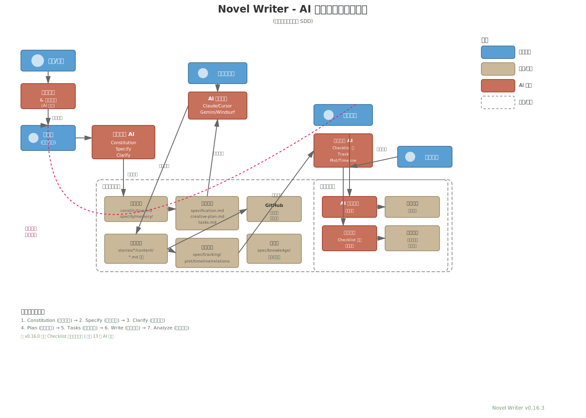
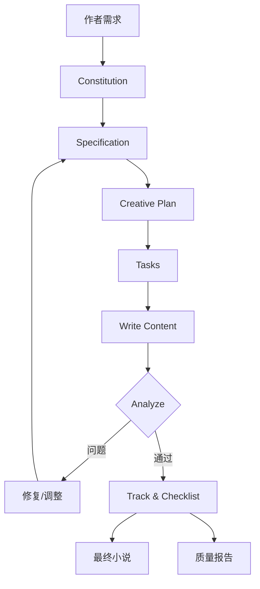

# Novel Writer 技术架构文档

## 概述

Novel Writer 是一个基于 **规格驱动开发（Specification-Driven Development, SDD）** 的 AI 驱动小说创作工具。它将软件工程的最佳实践应用于创意写作，通过系统化的七步方法论和 AI 辅助，帮助作者创作高质量的中文小说。

**核心理念**：
- 📋 **规格驱动** - 像写 PRD 一样写小说规格
- 🤖 **AI 增强** - 13 个 AI 平台深度集成
- 🔄 **迭代优化** - 持续验证、追踪和改进
- ✅ **质量保证** - 完善的检查和追踪系统

---

## 架构图



---

## 核心组件

### 1. CLI 工具 (novel-writer-cn)

**技术栈**：
- **语言**: TypeScript (Node.js 18+)
- **构建**: `tsc` + `tsx`
- **依赖**:
  - `commander` - CLI 框架
  - `inquirer` - 交互式问答
  - `chalk` - 终端颜色
  - `fs-extra` - 文件操作
  - `js-yaml` - YAML/TOML 解析
  - `ora` - 加载动画

**主要功能**：
```bash
novel init [name]          # 初始化项目
novel upgrade              # 升级项目到最新版本
novel plugins add/remove   # 管理插件
novel check                # 检查项目状态
```

### 2. AI 平台集成

支持 **13 个 AI 平台**，通过不同的命令格式和配置文件实现多平台兼容：

| 平台类型 | 配置格式 | 命令格式 | 示例平台 |
|---------|---------|---------|---------|
| **纯 Markdown** | 无 frontmatter | `/命令名` | Cursor, GitHub Copilot, CodeBuddy |
| **最小 frontmatter** | description 字段 | `/命令名` | OpenCode |
| **部分 frontmatter** | description + argument-hint | `/命令名` | Roo Code, Windsurf, Kilo Code |
| **完整 frontmatter** | 所有字段 | `/novel.命令名` | Claude Code |
| **TOML 格式** | description + prompt | `/novel/命令名` | Gemini CLI, Qwen Code |

**构建系统** (`scripts/build/generate-commands.sh`):
- 从 `templates/commands/` 单一源生成所有平台命令
- 自动适配每个平台的格式要求
- 支持插件命令注入

### 3. 插件系统

**插件机制**：
- **位置**: `src/plugins/` (核心) + `templates/plugins/` (模板)
- **类型**:
  - 写作增强：`authentic-voice` (真实人声)
  - 风格模仿：`luyao-style`, `wangyu-style`
  - 工具类：`translate`, `book-analysis`

**插件安装流程**：
```
novel plugins add <name>
  ↓
1. 复制插件命令到项目 .claude/commands/ 等
2. 复制配置模板到 .specify/memory/
3. 更新项目元数据
```

---

## 七步方法论详解

### 核心工作流

```
1. Constitution  →  定义创作宪法（最高原则）
2. Specify       →  编写故事规格（单一真相源）
3. Clarify       →  澄清模糊决策（5 个关键问题）
4. Plan          →  制定创作计划（章节结构）
5. Tasks         →  分解任务清单（可执行步骤）
6. Write         →  执行章节创作（AI 辅助写作）
7. Analyze       →  综合验证分析（双模式智能）
```

### 分层递归应用

SDD 不是线性流程，而是**分层递归**应用：

| 层级 | Specify | Plan | Tasks | Write | Analyze |
|------|---------|------|-------|-------|---------|
| **整本书** | ✅ | ✅ | ✅ | - | ✅ |
| **一卷** | ✅ | ✅ | ✅ | ✅ | ✅ |
| **章节段** | ✅ | ✅ | ✅ | ✅ | ✅ |
| **单章** | - | ✅ | - | ✅ | ✅ |

**关键洞察**: 每次规格变化时，回到相应层级重新执行 SDD 循环。

### 命令实现

每个命令包含：
- **Frontmatter** (可选): 元数据、工具权限、模型选择
- **动态上下文**: 通过 bash 脚本实时加载项目状态
- **提示词**: 详细的 AI 指令和最佳实践

**示例** (`/write` 命令):
```yaml
---
description: 基于任务清单进行章节创作
argument-hint: "[chapter-number] 或留空选择"
allowed-tools: ["Read(//*)", "Write(//*)", "Bash(chmod:*)"]
model: claude-sonnet-4-5-20250929
---

# 写作命令

[动态加载上下文]
- 最新章节内容
- 待办任务清单
- 角色验证规则
...

[AI 执行写作]
```

---

## 验证追踪系统

### 核心验证工具

| 工具 | 类型 | 功能 | 版本 |
|------|------|------|------|
| `/track-init` | 初始化 | 建立追踪系统基础数据 | v0.4.0+ |
| `/track` | 综合追踪 | 查看创作进度和状态 | v0.4.0+ |
| `/track --check` | 深度验证 | 批量检查一致性问题 | v0.6.0+ |
| `/track --fix` | 自动修复 | 修复简单的角色名错误 | v0.6.0+ |
| **`/checklist`** ⭐ | **质量检查** | **规格验证 + 内容扫描** | **v0.16.0+** |
| `/plot-check` | 情节检查 | 追踪情节节点、伏笔 | v0.4.0+ |
| `/timeline` | 时间线 | 维护时间逻辑一致性 | v0.4.0+ |
| `/relations` | 关系追踪 | 管理角色关系和派系 | v0.4.0+ |
| `/world-check` | 世界观 | 验证设定一致性 | v0.4.0+ |
| `/analyze` | 综合分析 | 智能双模式分析 | v0.10.0+ |

### Checklist 系统 (v0.16.0 新增)

**双保险机制**：

#### 第一类：规格质量检查（写作前）

验证文档质量，确保规格合格再开始创作：

```bash
/checklist 大纲质量            # 检查 creative-plan.md
/checklist 规格完整性          # 检查 specification.md
/checklist 世界观一致性        # 检查 worldbuilding/*.md
/checklist 角色档案            # 检查 characters/*.md
/checklist 线索规划            # 检查线索管理规格
```

**输出**: `spec/checklists/outline-quality.md` (覆盖模式)

#### 第二类：内容验证检查（写作后）

扫描已写章节，检查内容质量：

```bash
/checklist 人物一致性 1-10     # 扫描第 1-10 章
/checklist 情节逻辑 1-20       # 扫描第 1-20 章
/checklist 时间线 1-30         # 扫描第 1-30 章
/checklist 对话风格 5-15       # 扫描第 5-15 章
/checklist 宪法合规 1-50       # 扫描第 1-50 章
```

**输出**: `spec/checklists/character-consistency-20251011.md` (带日期)

**使用时机**：
```
写作前: /specify → /checklist 规格完整性 → /plan → /checklist 大纲质量 → /tasks → /write

写作后: /write (10章) → /checklist 人物一致性 1-10 → 修复问题 → 继续
```

---

## 数据流

### 从需求到成品的数据流转



### 文件组织

```
my-novel/
├── .specify/                    # Spec Kit 配置
│   ├── memory/
│   │   ├── constitution.md     # 创作宪法
│   │   └── personal-voice.md   # 个人语料（可选）
│   └── scripts/                # 辅助脚本
│       ├── bash/
│       └── powershell/
│
├── .claude/                    # Claude Code 命令
│   └── commands/
│       ├── constitution.md
│       ├── specify.md
│       └── ... (14+ 命令)
│
├── spec/                       # 小说规格数据
│   ├── tracking/
│   │   ├── plot-tracker.json
│   │   ├── timeline.json
│   │   ├── character-state.json
│   │   └── relationships.json
│   ├── knowledge/
│   │   ├── world-setting.md
│   │   ├── character-profiles.md
│   │   └── character-voices.md
│   └── checklists/             # ⭐ v0.16.0 新增
│       ├── outline-quality.md
│       └── character-consistency-*.md
│
└── stories/
    └── 001-story-name/
        ├── specification.md     # 故事规格（SoT）
        ├── creative-plan.md     # 创作计划
        ├── tasks.md             # 任务清单
        └── content/             # 章节内容
            ├── chapter-001.md
            ├── chapter-002.md
            └── ...
```

**单一真相源（Single Source of Truth）**：
- `specification.md` = 故事规格的 SoT
- `constitution.md` = 创作原则的 SoT
- 所有其他文件都基于这两个文件生成或验证

---

## 技术栈

### 核心技术

| 技术 | 版本 | 用途 |
|------|------|------|
| **Node.js** | 18+ | 运行时环境 |
| **TypeScript** | 5.3+ | 主开发语言 |
| **Commander.js** | 12.0+ | CLI 框架 |
| **Inquirer.js** | 9.2+ | 交互式问答 |
| **fs-extra** | 11.2+ | 文件系统操作 |
| **js-yaml** | 4.1+ | YAML/TOML 解析 |
| **Chalk** | 5.3+ | 终端颜色 |
| **Ora** | 8.0+ | 加载动画 |

### 脚本支持

| 平台 | 脚本类型 | 位置 |
|------|---------|------|
| Unix/Linux/Mac | Bash | `scripts/bash/` |
| Windows | PowerShell | `scripts/powershell/` |

**核心脚本**：
- `common.sh` / `common.ps1` - 公共函数库
- `constitution.sh` - 创作宪法脚本
- `specify-story.sh` - 故事规格脚本
- `plan-story.sh` - 创作计划脚本
- `tasks-story.sh` - 任务分解脚本
- `analyze-story.sh` - 综合验证脚本
- `track-progress.sh` - 追踪脚本
- `init-tracking.sh` - 初始化追踪
- `check-writing-state.sh` - 检查写作状态

---

## 扩展性

### 1. 多平台支持机制

**构建时自动生成**：
```bash
npm run build:commands
  ↓
scripts/build/generate-commands.sh
  ↓
从 templates/commands/ 生成 → dist/commands-*/
  ↓
novel init 时复制到项目
```

**关键设计**：
- **单一源**: 只维护 `templates/commands/` 一套命令
- **构建系统**: 自动适配 13 个平台的格式
- **命名空间**: Claude 用 `novel.*`, Gemini 用 `novel/`, 避免冲突

### 2. 插件机制

**插件接口** (`src/plugins/PluginManager.ts`):
```typescript
interface Plugin {
  name: string;
  version: string;
  commands: PluginCommand[];
  templates: PluginTemplate[];
  config?: PluginConfig;
}

interface PluginCommand {
  name: string;           // 命令名称
  content: string;        // 命令内容（Markdown）
  platforms?: string[];   // 支持的平台
}
```

**创建插件步骤**：
1. 在 `templates/plugins/<plugin-name>/` 创建插件目录
2. 添加命令文件 `commands/`
3. 添加配置模板 `memory/` 或 `knowledge/`
4. 定义 `plugin.json` 元数据
5. 运行构建系统生成多平台版本

**官方插件**：
- `authentic-voice` - 真实人声写作（提升原创度）
- `translate` - 多语言翻译
- `luyao-style` - 路遥风格模仿
- `wangyu-style` - 王钰风格模仿
- `book-analysis` - 书籍分析工具

### 3. 自定义命令

用户可以在项目中添加自定义命令：

```bash
# 1. 创建命令文件
my-novel/.claude/commands/my-command.md

# 2. 编写命令内容
---
description: 我的自定义命令
---

# My Command

这是自定义命令内容...

# 3. 在 AI 助手中使用
/my-command
```

---

## 版本演进

### 关键里程碑

| 版本 | 时间 | 重大特性 |
|------|------|---------|
| **v0.10.0** | 2025-09 | 🎉 **七步方法论体系** - SDD 完整流程 |
| v0.11.0 | 2025-09 | 📖 SDD 实战指南（10000 字） |
| **v0.12.0** | 2025-09 | 🧵 **多线索管理系统** |
| **v0.12.2** | 2025-10 | 💎 **Claude Code 增强层** - 动态上下文 |
| v0.14.0 | 2025-10 | 🤖 Roo Code 支持 |
| **v0.14.2** | 2025-10 | 📊 **中文字数统计修复** (准确度提升 12 倍) |
| **v0.15.0** | 2025-10 | 🌐 **多平台命令格式优化** - 13 个平台完整支持 |
| **v0.16.0** | 2025-10 | ✅ **Checklist 系统** - 质量检查双保险 |

### 架构演进

#### Phase 1: 基础工具 (v0.1.0 - v0.9.0)
- 基本命令集
- 单一 AI 平台支持
- 简单的追踪系统

#### Phase 2: 方法论体系 (v0.10.0 - v0.12.1)
- **七步方法论**完整落地
- **多线索管理**系统化
- **分层递归** SDD 应用

#### Phase 3: AI 增强 (v0.12.2 - v0.14.2)
- **Claude Code 增强层**（动态上下文、细粒度权限）
- **多平台扩展**（13 个 AI 平台）
- **中文优化**（字数统计、语言特性）

#### Phase 4: 质量保障 (v0.15.0 - v0.16.x)
- **命令格式优化**（平台兼容性）
- **Checklist 系统**（规格验证 + 内容扫描）
- **插件生态**（真实人声、风格模仿）

---

## 设计哲学

### 1. 克制而不简陋

**原则**: "如无必要，请勿增加"

**实践**:
- ❌ 不创建冗余命令（如 `/framework-analyze` + `/content-analyze`）
- ✅ 智能化单一命令（`/analyze` 自动判断场景）
- ❌ 不为多线索创建新命令
- ✅ 增强现有命令（在 `/specify` 中添加线索管理）

### 2. 规格驱动

**核心思想**: 先定义"要什么"（Spec），再决定"怎么做"（Implementation）

**对比**:
```
传统: 灵感 → 直接写 → 写到哪算哪 → 大改/弃坑

SDD:  灵感 → Specify → Plan → Tasks → Write → Analyze
        ↑                                        ↓
        └──────── 发现问题，回到适当层级 ────────┘
```

### 3. 允许偏离，但同步规格

**理念**: AI 可能写出比计划更好的内容，保留偏离，但立即更新上游规格。

**流程**:
```
AI 写出偏离内容
  ↓
评估: 是否更好?
  ↓
好 → 保留 → 更新 specification.md/plan.md/tasks.md
  ↓
继续写，AI 基于新规格
```

### 4. 频繁验证

**防止累积错误**:
```
传统: 写 100 章 → 发现前 50 章有 bug → 大规模返工

SDD:  每 5-10 章验证 → 发现小问题 → 小修复 → 继续
```

**验证频率**:
- **规格完成后**: `/checklist 规格完整性`
- **计划完成后**: `/checklist 大纲质量`
- **每章写完**: AI 自动验证角色名、基本逻辑
- **每 5-10 章**: `/track --check` + `/checklist 人物一致性`
- **完成一卷**: 全面验证（plot/timeline/relations/world）
- **完成全书**: `/analyze` 综合质量审核

---

## 未来展望

### 短期规划 (v0.17.x - v0.18.x)

1. **增强追踪系统**
   - 自动化伏笔检测
   - 角色弧光追踪
   - 情节节奏可视化

2. **插件生态**
   - 插件市场（npm registry）
   - 社区贡献插件
   - 插件开发 SDK

3. **协作功能**
   - 多作者协作模式
   - 评审流程
   - 版本对比

### 中期规划 (v0.19.x - v0.20.x)

1. **可视化工具**
   - Web 界面（可选）
   - 情节节点图
   - 时间线可视化
   - 角色关系图

2. **更多 AI 平台**
   - OpenAI API 直接集成
   - 本地 LLM 支持（Ollama）
   - 自定义 AI 端点

3. **输出格式**
   - EPUB 导出
   - PDF 排版
   - 在线发布（起点、晋江等）

### 长期愿景

**目标**: 成为中文小说创作的**开发环境（IDE）**

- 📝 **编辑器**: VSCode 插件，实时 AI 建议
- 🤖 **智能助手**: 多模型协同（Claude 规划 + GPT-4 写作）
- 📊 **数据分析**: 阅读数据反馈，优化情节
- 🌐 **发布平台**: 一键发布到多个小说平台
- 👥 **社区生态**: 共享模板、插件、最佳实践

---

## 相关链接

- **GitHub**: [https://github.com/wordflowlab/novel-writer](https://github.com/wordflowlab/novel-writer)
- **npm**: [https://www.npmjs.com/package/novel-writer-cn](https://www.npmjs.com/package/novel-writer-cn)
- **文档**: [https://wordflowlab.github.io/novel-writer/](https://wordflowlab.github.io/novel-writer/)
- **实战指南**: [docs/writing/practical-guide.md](../writing/practical-guide.md)
- **命令详解**: [docs/commands.md](../commands.md)
- **最佳实践**: [docs/best-practices.md](../best-practices.md)

---

## 贡献

欢迎贡献代码、插件、文档！

**贡献方式**:
- 🐛 提交 Issue 报告问题
- 💡 提出新功能建议
- 🔧 提交 Pull Request
- 📖 改进文档
- 🔌 开发插件

---

**Novel Writer** - 让 AI 成为你的创作伙伴！ ✨📚

*文档版本: v0.16.3 | 最后更新: 2025-10-12*
