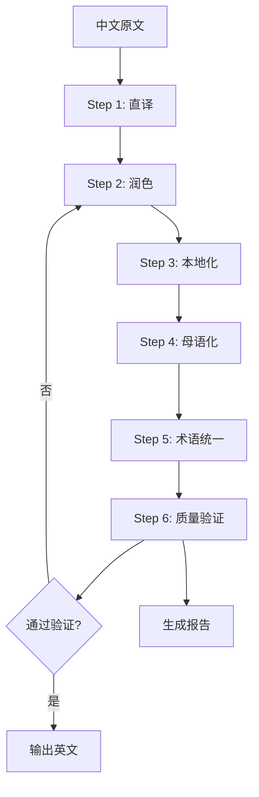

# Novel Writer 翻译插件 PRD

## 1. 产品概述

### 1.1 产品名称
**Novel Writer Translate Plugin** - 中文小说英文出海翻译插件

### 1.2 产品定位
Novel Writer 的官方翻译插件，专为中文小说出海设计。充分利用 AI 环境（Claude Code、Cursor等）的语言能力，通过多步骤翻译流程和质量控制体系，帮助作者将中文作品翻译成地道的英文，适配 Medium、Reddit、Webnovel 等不同平台的语言风格。

### 1.3 实现状态
**已实现基础版本**，包括核心翻译命令、润色命令和翻译专家模式。

### 1.4 核心价值
- **零成本翻译**：完全利用现有 AI 环境，无需额外API费用
- **多步骤优化**：从直译到本地化，层层优化翻译质量
- **平台适配**：针对不同平台调整语言风格
- **质量保证**：回译验证和AI交叉检查
- **术语一致**：专有名词管理系统

### 1.5 设计理念

基于社区分享的最佳实践，完全依托 AI 环境的强大能力：

1. **多轮翻译**：直译 → 润色 → 本地化 → 母语化
2. **风格适配**：根据目标平台调整表达方式
3. **质量验证**：回译对比 + 差异报告
4. **专业管理**：术语表 + 上下文维护

## 2. 功能架构

### 2.1 实现的命令体系

```
/translate          # 基础翻译命令（已实现）
/polish            # 英文润色命令（已实现）
/expert translate  # 翻译专家模式（已实现）

# 计划中的命令：
/translate-verify   # 翻译验证
/translate-glossary # 术语管理
/translate-batch    # 批量翻译
```

### 2.2 翻译流程图



## 3. 详细功能设计

### 3.1 核心翻译命令 `/translate`

#### 3.1.1 命令模板
```markdown
---
description: 将中文章节翻译成地道英文
scripts:
  sh: .specify/plugins/translate/scripts/bash/translate.sh
  ps: .specify/plugins/translate/scripts/powershell/translate.ps1
---

## 智能翻译流程

### 第一步：准备阶段
1. 读取当前章节内容
2. 加载术语表 (translation/glossary.json)
3. 获取上文摘要 (translation/context.json)
4. 确认目标平台和风格

### 第二步：多轮翻译

#### Round 1: 基础直译
"请将以下中文翻译成英文，保持所有细节、情感和文化内涵："
[中文内容]

#### Round 2: 润色优化
"请优化这段英文，使其更加流畅自然，但不要改变原意："
[英文内容]

#### Round 3: 平台适配
"请将这段英文改写成适合 [Medium/Reddit/Webnovel] 平台的风格，
让美国读者感觉这是 native speaker 写的："
[英文内容]

#### Round 4: 专有名词统一
应用术语表，确保：
- 人名翻译一致
- 地名翻译统一
- 专有概念保持一致

### 第三步：输出管理
1. 保存到 chapters-en/[章节号].md
2. 更新翻译进度 translation/progress.json
3. 生成对比文件 translation/compare/[章节号].md
```

#### 3.1.2 执行脚本
```bash
#!/usr/bin/env bash
# translate.sh

# 获取参数
CHAPTER_FILE=$1
TARGET_LANG=${2:-"en-US"}
PLATFORM=${3:-"medium"}

# 创建输出目录
mkdir -p chapters-en
mkdir -p translation/{compare,reports}

# 输出配置信息
echo "📚 开始翻译章节"
echo "源文件: $CHAPTER_FILE"
echo "目标语言: $TARGET_LANG"
echo "目标平台: $PLATFORM"

# 检查术语表
if [ -f "translation/glossary.json" ]; then
    echo "✅ 已加载术语表"
else
    echo "⚠️ 未找到术语表，将创建默认术语表"
    mkdir -p translation
    echo '{"characters":{},"locations":{},"concepts":{}}' > translation/glossary.json
fi

# 返回成功，让 AI 接管翻译流程
exit 0
```

### 3.2 翻译验证命令 `/translate-verify`

#### 3.2.1 验证流程
```markdown
## 三重验证机制

### 验证步骤

#### 1. 回译验证
"将以下英文翻译回中文："
[英文内容]

对比原文，检查：
- 主要信息是否完整
- 情感色彩是否保留
- 文化内涵是否准确

#### 2. Native Speaker 检查
"假设你是一个美国读者，请评价这段文字：
1. 是否像母语者写的？
2. 有哪些不自然的地方？
3. 需要解释的文化概念？"

#### 3. 差异报告生成
| 检查项 | 状态 | 说明 |
|--------|------|------|
| 信息完整性 | ✅/⚠️/❌ | 详细说明 |
| 语言自然度 | ✅/⚠️/❌ | 详细说明 |
| 文化适配性 | ✅/⚠️/❌ | 详细说明 |
| 术语一致性 | ✅/⚠️/❌ | 详细说明 |
```

#### 3.2.2 验证报告模板
```markdown
# 翻译验证报告

## 章节信息
- 章节：第[X]章 [标题]
- 原文字数：[X]
- 译文词数：[X]
- 翻译时间：[时间戳]

## 回译对比

### 关键段落对比
| 原文 | 译文 | 回译 | 偏差度 |
|------|------|------|--------|
| ... | ... | ... | 95% |

### 信息完整性评估
- 主要情节点：✅ 完整保留
- 人物对话：✅ 语气恰当
- 环境描写：⚠️ 部分简化
- 文化特色：❌ 需要注释

## Native Speaker 视角

### 自然度评分：8.5/10

### 问题点：
1. "cultivation" 一词出现频率过高，建议变换表达
2. 第3段的句式过于中式，建议重构
3. "face" 概念需要文化背景解释

### 改进建议：
[具体修改建议]

## 最终评级
- **整体质量**：B+
- **建议**：小幅修改后可发布
```

### 3.3 术语管理命令 `/translate-glossary`

#### 3.3.1 术语表结构
```json
{
  "metadata": {
    "version": "1.0",
    "lastUpdate": "2025-09-22",
    "targetLanguage": "en-US"
  },
  "characters": {
    "李明": {
      "primary": "Li Ming",
      "alternatives": ["Ming Li", "Lee Ming"],
      "pronunciation": "Lee Ming",
      "description": "主角，姓李名明",
      "firstAppearance": "chapter-1"
    },
    "苏婉儿": {
      "primary": "Su Wan'er",
      "alternatives": ["Wan'er", "Lady Su"],
      "description": "女主角",
      "note": "保留中文韵味"
    }
  },
  "locations": {
    "青云山": {
      "primary": "Azure Cloud Mountain",
      "literal": "Qingyun Mountain",
      "type": "山脉",
      "description": "主角门派所在地"
    },
    "天机阁": {
      "primary": "Heavenly Secrets Pavilion",
      "literal": "Tianji Pavilion",
      "type": "建筑"
    }
  },
  "concepts": {
    "修仙": {
      "primary": "cultivation",
      "alternatives": [
        "cultivating immortality",
        "pursuing the Dao"
      ],
      "explanation": "The practice of refining one's body and spirit to achieve immortality",
      "contextual": {
        "formal": "cultivation of immortality",
        "casual": "cultivation",
        "explanatory": "the ancient art of cultivation"
      }
    },
    "灵气": {
      "primary": "spiritual energy",
      "alternatives": ["qi", "spiritual qi", "essence"],
      "usage": "根据上下文选择"
    },
    "金丹": {
      "primary": "Golden Core",
      "literal": "Jindan",
      "explanation": "A crystallized energy core formed in a cultivator's dantian",
      "stage": "cultivation_level_3"
    }
  },
  "idioms": {
    "画蛇添足": {
      "primary": "gilding the lily",
      "literal": "adding feet to a snake",
      "meaning": "做多余的事情",
      "usage": "当角色做了不必要的事情时"
    },
    "狐假虎威": {
      "primary": "borrowing the tiger's might",
      "alternatives": ["false bravado"],
      "meaning": "借助他人的威势"
    }
  },
  "titles": {
    "掌门": {
      "primary": "Sect Master",
      "alternatives": ["Sect Leader", "Master"],
      "usage": "正式场合用 Sect Master"
    },
    "长老": {
      "primary": "Elder",
      "context": {
        "respectful": "Honored Elder",
        "casual": "Elder [Name]"
      }
    }
  },
  "rules": {
    "nameOrder": "中文姓名顺序（姓在前）",
    "titles": "称谓保持一致性",
    "explanations": "首次出现时提供简短解释"
  }
}
```

#### 3.3.2 术语管理功能
```markdown
## 术语管理命令

### 添加术语
/translate-glossary add --type character --chinese "张三" --english "Zhang San"

### 批量导入
/translate-glossary import [文件路径]

### 智能提取
"分析当前章节，提取需要翻译的专有名词"

### 一致性检查
"检查所有已翻译章节的术语一致性"
```

### 3.4 批量翻译命令 `/translate-batch`

#### 3.4.1 批量处理流程
```markdown
## 批量翻译管理

### 任务配置
1. 选择章节范围（如：1-10章）
2. 设置翻译参数
3. 配置并行数（建议：3个）

### 执行策略
- 顺序翻译：保持上下文连贯
- 断点续传：支持中断后继续
- 进度追踪：实时显示进度

### 质量控制
- 每5章进行一次整体校对
- 术语一致性自动检查
- 生成批次报告
```

### 3.5 风格设定命令 `/translate-style`

#### 3.5.1 平台风格配置
```json
{
  "medium": {
    "sentenceLength": "medium",
    "paragraphLength": "short",
    "tone": "professional",
    "vocabulary": "accessible",
    "features": [
      "使用小标题分段",
      "开篇要吸引人",
      "结尾要有思考"
    ]
  },
  "reddit": {
    "sentenceLength": "varied",
    "tone": "casual",
    "vocabulary": "colloquial",
    "features": [
      "使用 Reddit 常见表达",
      "适当使用网络用语",
      "保持对话感"
    ]
  },
  "webnovel": {
    "sentenceLength": "short",
    "tone": "dramatic",
    "vocabulary": "simple",
    "features": [
      "快节奏叙述",
      "多用短句制造紧张感",
      "章节结尾留悬念"
    ]
  },
  "royalroad": {
    "tone": "immersive",
    "vocabulary": "fantasy-oriented",
    "features": [
      "详细的世界观描述",
      "系统化的能力说明",
      "数据化的成长体系"
    ]
  }
}
```

### 3.6 上下文管理命令 `/translate-context`

#### 3.6.1 上下文维护
```json
{
  "currentChapter": 15,
  "previousSummary": "主角刚刚突破到金丹期...",
  "characterStatus": {
    "李明": {
      "level": "Golden Core Stage",
      "location": "Azure Cloud Mountain",
      "relationship": {
        "苏婉儿": "mutual affection developing"
      }
    }
  },
  "ongoingPlots": [
    "寻找失踪的师父",
    "调查魔教阴谋"
  ],
  "foreshadowing": [
    {
      "chapter": 10,
      "element": "神秘玉佩",
      "status": "unresolved"
    }
  ]
}
```

## 4. 技术实现

### 4.1 实际插件结构

```
plugins/translate/
├── config.yaml           # 插件配置（已实现）
├── commands/             # 命令目录（已实现）
│   ├── translate.md     # 翻译命令
│   └── polish.md        # 润色命令
└── experts/              # 专家目录（已实现）
    └── translate.md      # 翻译专家
```

### 4.2 核心翻译引擎

```javascript
class TranslationEngine {
  constructor(aiEnvironment) {
    this.ai = aiEnvironment; // Claude/Cursor 等环境
    this.glossary = new GlossaryManager();
    this.context = new ContextManager();
  }

  async translate(text, options = {}) {
    const { platform = 'medium', style = 'default' } = options;

    // 多步骤翻译流程
    let result = text;

    // Step 1: 直译
    result = await this.directTranslate(result);

    // Step 2: 润色
    result = await this.polish(result);

    // Step 3: 本地化
    result = await this.localize(result, platform);

    // Step 4: 术语统一
    result = await this.applyGlossary(result);

    return result;
  }

  async directTranslate(text) {
    const prompt = `Translate the following Chinese text to English, preserving all details and emotions:\n\n${text}`;
    return await this.ai.complete(prompt);
  }

  async polish(text) {
    const prompt = `Polish this English text to make it more natural and fluent, without changing the meaning:\n\n${text}`;
    return await this.ai.complete(prompt);
  }

  async localize(text, platform) {
    const styleGuide = this.getStyleGuide(platform);
    const prompt = `Rewrite this text in the style of ${platform} content, as if written by a native English speaker:\n\nStyle guide: ${styleGuide}\n\nText: ${text}`;
    return await this.ai.complete(prompt);
  }

  async applyGlossary(text) {
    const terms = await this.glossary.getTerms();
    // 应用术语替换逻辑
    return this.glossary.apply(text, terms);
  }
}
```

### 4.3 质量验证系统

```javascript
class QualityChecker {
  async verify(original, translated) {
    const checks = {
      backTranslation: await this.backTranslate(translated),
      nativeCheck: await this.checkNaturalness(translated),
      completeness: await this.checkCompleteness(original, translated),
      consistency: await this.checkConsistency(translated)
    };

    return this.generateReport(checks);
  }

  async backTranslate(text) {
    const prompt = `Translate this English text back to Chinese:\n\n${text}`;
    const result = await this.ai.complete(prompt);
    return result;
  }

  async checkNaturalness(text) {
    const prompt = `As an American reader, rate how natural this text sounds (1-10) and list any unnatural expressions:\n\n${text}`;
    return await this.ai.complete(prompt);
  }

  generateReport(checks) {
    return {
      score: this.calculateScore(checks),
      issues: this.extractIssues(checks),
      suggestions: this.generateSuggestions(checks)
    };
  }
}
```

## 5. 用户交互流程

### 5.1 首次使用

```
用户：/translate
AI：检测到首次使用翻译功能，需要初始化设置：

1. 目标平台是？(Medium/Reddit/Webnovel/RoyalRoad)
用户：Medium

2. 是否有现有的术语表？(Y/N)
用户：N

AI：已创建默认配置。开始分析当前章节...

[AI 执行翻译流程]

AI：翻译完成！
- 原文：3000字
- 译文：1856词
- 质量评分：8.7/10
- 保存位置：chapters-en/chapter-001.md

需要查看验证报告吗？
```

### 5.2 术语管理

```
用户：/translate-glossary

AI：术语表管理功能：
1. 查看当前术语（23个）
2. 添加新术语
3. 批量导入
4. 智能提取
5. 导出术语表

请选择操作（1-5）：

用户：4

AI：正在分析最新章节，提取专有名词...

发现以下新术语：
1. 天元剑法 - 建议翻译：Heavenly Origin Sword Technique
2. 百花谷 - 建议翻译：Hundred Flowers Valley
3. 灵兽 - 建议翻译：Spirit Beast

是否添加到术语表？(Y/N)
```

### 5.3 批量翻译

```
用户：/translate-batch 1-10

AI：准备批量翻译第1-10章

配置确认：
- 章节范围：1-10
- 目标平台：Medium
- 预计时间：30分钟
- 术语表：已加载（45个术语）

开始翻译？(Y/N)

用户：Y

AI：开始批量翻译...
[■■■□□□□□□□] 30% - 正在翻译第3章
已完成：2章
当前：第3章 - 初入山门
剩余：7章
预计剩余时间：21分钟
```

## 6. 数据存储

### 6.1 文件组织

```
novel-project/
├── stories/my-story/
│   ├── chapters/           # 中文原文
│   │   ├── chapter-001.md
│   │   └── ...
│   ├── chapters-en/        # 英文翻译
│   │   ├── chapter-001.md
│   │   └── ...
│   └── translation/        # 翻译数据
│       ├── glossary.json   # 术语表
│       ├── context.json    # 上下文
│       ├── style.json      # 风格配置
│       ├── progress.json   # 进度追踪
│       ├── compare/        # 对比文件
│       │   └── chapter-001-compare.md
│       └── reports/        # 验证报告
│           └── chapter-001-report.md
```

### 6.2 进度追踪

```json
{
  "totalChapters": 240,
  "translatedChapters": 15,
  "lastTranslated": "chapter-015",
  "lastTranslatedTime": "2025-09-22T10:30:00Z",
  "statistics": {
    "totalSourceWords": 45000,
    "totalTranslatedWords": 28500,
    "averageQualityScore": 8.6,
    "timeSpent": "12:30:00"
  },
  "chapters": {
    "chapter-001": {
      "status": "completed",
      "quality": 8.9,
      "wordCount": 1856,
      "translatedAt": "2025-09-20T10:00:00Z",
      "lastModified": "2025-09-21T15:30:00Z"
    }
  }
}
```

## 7. 性能优化

### 7.1 翻译缓存
- 缓存已翻译段落
- 缓存常用表达
- 缓存验证结果

### 7.2 增量翻译
- 只翻译修改的部分
- 保持未修改内容不变
- 智能检测变更

### 7.3 并行处理
- 段落级并行翻译
- 批量验证
- 异步报告生成

## 8. 质量保证

### 8.1 自动化测试
- 术语一致性测试
- 回译准确度测试
- 风格匹配度测试

### 8.2 人工审核接口
```markdown
## 审核模式

将翻译结果导出为对比格式，便于人工审核：

| 原文 | 机翻 | 建议修改 | 最终版 |
|------|------|----------|--------|
| ... | ... | [可编辑] | [确认] |
```

### 8.3 版本管理
- 每次翻译保存版本
- 支持版本对比
- 支持版本回滚

## 9. 扩展功能

### 9.1 语音朗读集成
- 生成音频文件
- 多音色选择
- 语速调节

### 9.2 电子书导出
- EPUB格式
- PDF格式
- Kindle格式

### 9.3 平台直发
- Medium API集成
- Reddit自动发帖
- Webnovel上传

## 10. 成功指标

### 10.1 质量指标
- 平均质量评分 > 8.5/10
- 术语一致率 > 99%
- 用户满意度 > 90%

### 10.2 效率指标
- 翻译速度 > 2000字/10分钟
- 返工率 < 5%
- 自动化率 > 95%

### 10.3 使用指标
- 月活跃用户 > 1000
- 累计翻译字数 > 1000万
- 成功出海作品 > 50部

## 11. 发展路线图

### Phase 1: MVP版本（4周）
- 基础翻译功能
- 术语管理
- 质量验证

### Phase 2: 增强版本（4周）
- 批量处理
- 风格定制
- 上下文管理

### Phase 3: 专业版本（8周）
- 多语言支持
- 平台API集成
- 团队协作功能

---

**文档版本**: v1.0
**创建日期**: 2025-09-22
**作者**: Novel Writer Team
**状态**: 待评审