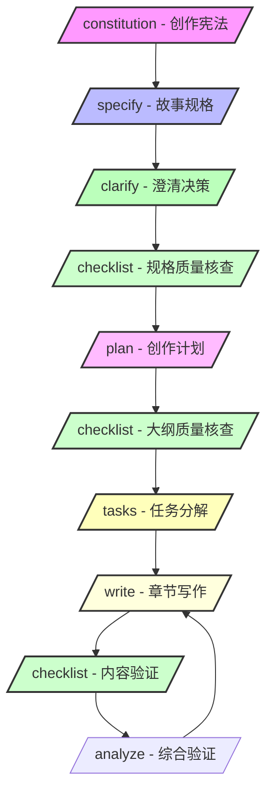
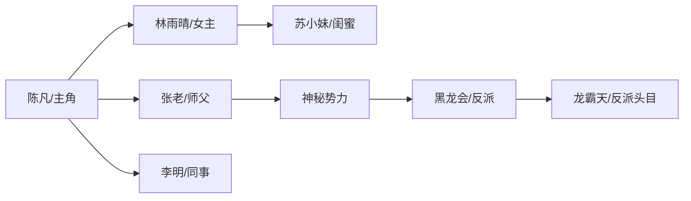

# 创作流程指南

本指南详细介绍使用 Novel Writer 进行小说创作的完整流程。Novel Writer 参考 Spec-Kit 的方法论，将规格驱动开发（SDD）理念应用于创作领域。

## 核心理念

### 规格驱动创作（Spec-Driven Writing）

参考 Spec-Kit 的 SDD 方法论，Novel Writer 采用分层递进的创作模式：

1. **规格定义**：先定义作品的整体规格（风格、主题、结构）
2. **计划制定**：将规格细化为可执行的创作计划
3. **任务分解**：将计划分解为具体的写作任务
4. **迭代实现**：逐步实现每个任务，持续迭代改进

## 创作流程概览



## 阶段一：准备工作

### 1.1 环境准备

```bash
# 安装工具
npm install -g novel-writer-cn

# 创建项目
novel init 我的小说

# 进入项目
cd 我的小说
```

### 1.2 选择 AI 助手

根据你的需求选择合适的 AI 助手：

| AI 助手 | 优势 | 适用场景 |
|---------|------|----------|
| Claude | 理解力强，创作质量高 | 文学性较强的作品 |
| Cursor | 集成开发环境，效率高 | 需要频繁修改的创作 |
| Gemini | 知识面广，想象力丰富 | 科幻、奇幻类作品 |

### 1.3 项目结构理解

参考 Spec-Kit 的组织方式，Novel Writer 采用清晰的分层结构：

```
我的小说/
├── templates/         # 命令模板（参考spec-kit）
│   └── commands/      # 各种创作命令
├── memory/            # 创作记忆（风格、设定）
│   ├── constitution.md # 创作宪法
│   └── style.md       # 风格规范
├── specs/             # 生成的作品（参考spec-kit）
│   └── 001-故事名/
│       ├── spec.md    # 故事规格
│       ├── plan.md    # 创作计划
│       ├── tasks.md   # 任务列表
│       ├── chapters/  # 章节内容
│       ├── characters/# 角色设定
│       └── worldbuilding/ # 世界观
└── scripts/           # 辅助脚本
    ├── bash/          # Bash 脚本
    └── powershell/    # PowerShell 脚本
```

## 阶段二：创作规划

### 2.1 建立创作宪法（/constitution）

创作宪法是最高层级的创作原则，需要明确：

#### 基础设定
- **文体风格**：网文/文学/轻小说
- **叙事视角**：第一人称/第三人称/全知视角
- **时态选择**：过去时/现在时
- **目标读者**：年龄层、性别、阅读偏好

#### 写作规范
- **章节长度**：每章字数范围
- **更新频率**：日更/周更/不定期
- **语言风格**：正式/口语化/网络化
- **描写重点**：动作/心理/环境/对话

#### 示例设定

```text
/constitution
【核心价值观】
- 故事传达正能量和成长
- 强调努力和智慧的重要性

【质量标准】
- 每章必须推进故事
- 人物行为符合性格设定
- 世界观逻辑自洽

【创作风格】
- 文体：网络小说，爽文向
- 视角：第三人称限制视角
- 语言：通俗易懂，节奏明快

【内容规范】
- 每章3000-4000字
- 避免过度暴力描写
- 不涉及敏感话题
```

### 2.2 定义故事规格（/specify）

像产品经理写PRD一样定义故事规格：

#### 核心设定
1. **一句话介绍**：用一句话说清你的故事
2. **核心冲突**：主角面临的核心问题
3. **主题思想**：想要表达的价值观

#### 角色设定
1. **主角设定**
   - 基础信息（姓名、年龄、职业）
   - 性格特点
   - 成长弧线
   - 核心动机

2. **重要配角**
   - 与主角的关系
   - 在故事中的作用
   - 个人特色

#### 世界观设定
1. **时代背景**
2. **地理环境**
3. **社会规则**
4. **力量体系**（如有）

#### 情节结构
采用经典的三幕结构或起承转合：

1. **开端**（1-25%）
   - 建立世界观
   - 介绍主角
   - 引出冲突

2. **发展**（25-75%）
   - 冲突升级
   - 角色成长
   - 关系变化

3. **高潮与结局**（75-100%）
   - 最终对决
   - 问题解决
   - 收尾留念

### 2.3 澄清关键决策（/clarify）

AI会识别规格中的模糊点，通过5个问题澄清：

```text
/clarify
AI: 我发现了以下需要澄清的关键点：
1. 主角的金手指是系统还是传承？
2. 故事节奏是爽文快节奏还是慢热型？
3. 感情线是单女主还是多女主？
...
```

### 2.4 规格质量检查（/checklist）

完成规格澄清后，使用 `/checklist 规格完整性` 确认文档质量：

1. **运行命令**：`/checklist 规格完整性`，检查 `spec/specification.md` 的完整性、可追踪性与一致性
2. **定位问题**：Checklist 会输出未覆盖的章节、模糊描述和冲突点，并保存在 `spec/checklists/` 目录
3. **修复再检**：根据问题清单迭代规格文档，直至 checklist 全部通过

这一步确保后续规划和写作基于可靠的规格文档。

### 2.5 制定创作计划（/plan）

基于澄清后的规格制定技术实现方案：

#### 规划原则
1. **节奏控制**
   - 张弛有度
   - 高潮分布合理
   - 悬念设置恰当

2. **功能明确**
   - 每章都要推进剧情
   - 避免注水章节
   - 信息量适中

3. **连贯性**
   - 章节间逻辑清晰
   - 伏笔与回收对应
   - 时间线明确

#### 计划模板

```text
/plan
【第一卷：新手村】（1-30章）

第1-3章：开篇
- 第1章：引子，展现主角困境
- 第2章：转机出现，获得金手指
- 第3章：初次使用，尝到甜头

第4-10章：探索期
- 第4-6章：了解能力，制定计划
- 第7-8章：首个小目标
- 第9-10章：初战告捷，信心建立

第11-20章：成长期
- 第11-13章：遇到阻碍，压力出现
- 第14-16章：寻找突破，获得助力
- 第17-18章：解决危机，实力提升
- 第19-20章：阶段性胜利

第21-30章：突破期
- 第21-23章：更大挑战
- 第24-26章：生死考验
- 第27-29章：绝地反击
- 第30章：第一卷高潮，等级突破
```

### 2.6 任务分解（/tasks）

将章节规划转化为可执行的任务：

#### 任务类型
1. **写作任务**
   - 具体章节创作
   - 场景描写
   - 对话编写

2. **设定任务**
   - 角色深化
   - 世界观补充
   - 系统规则完善

3. **修订任务**
   - 逻辑检查
   - 风格统一
   - 错字修正

#### 优先级设置
- **P0 紧急**：影响主线的关键章节
- **P1 重要**：重要配角或设定
- **P2 常规**：正常推进章节
- **P3 补充**：锦上添花的内容

## 阶段三：内容创作

### 3.1 章节写作（/write）

#### 写作前准备
1. **回顾前文**
   - 检查剧情连贯性
   - 确认伏笔线索
   - 统计人物状态

2. **明确本章目标**
   - 要推进什么剧情
   - 要展现什么信息
   - 要制造什么悬念

#### 写作要点
1. **开篇吸引**
   - 承接上章
   - 快速入戏
   - 设置钩子

2. **中段发展**
   - 推进主线
   - 深化人物
   - 信息适量

3. **结尾艺术**
   - 适度收束
   - 留下悬念
   - 引出下章

#### 示例写作指令

```text
/write 第5章 初露锋芒

本章要点：
1. 主角在公司展现异常能力
2. 引起女主角的注意
3. 埋下反派势力的伏笔

具体场景：
- 开篇：早会上的技术难题
- 发展：主角轻松解决，同事震惊
- 转折：女主私下询问
- 结尾：神秘电话，提到主角名字

注意事项：
- 不要暴露太多能力
- 对话要符合职场环境
- 保持主角低调的人设
```

### 3.2 阶段性质量检查（/checklist）

结合写作节奏，定期运行 `/checklist` 命令，保持内容质量：

1. **写作中段**：每完成 5-10 章，执行如 `/checklist 人物一致性 1-10`、`/checklist 情节逻辑 1-20` 检查角色、剧情、时间线
2. **针对性检查**：根据发现的问题选择 `/checklist 世界观一致性`、`/checklist 对话风格` 等专项清单
3. **问题追踪**：Checklist 输出保存在 `spec/checklists/`，根据结果修复章节后再次执行命令

Checklist 阶段性把控可在正式分析前就捕捉结构和设定上的偏差。

### 3.3 质量验证（/analyze）

每5章进行一次综合验证：

```text
/analyze
七个维度检查：
1. 合规性 - 是否符合宪法
2. 一致性 - 逻辑是否自洽
3. 完整性 - 任务完成情况
4. 质量性 - 文字质量评估
5. 创新性 - 亮点识别
6. 可读性 - 流畅度检查
7. 可行性 - 进度评估
```

### 3.4 角色管理

#### 角色卡片
为每个重要角色创建详细卡片：

```markdown
# 角色：林雨晴

## 基础信息
- 年龄：24岁
- 职业：产品经理
- 外貌：长发及腰，清秀可人

## 性格特征
- 认真负责，追求完美
- 外冷内热，重情重义
- 好奇心强，喜欢探索

## 背景故事
- 名牌大学毕业
- 家境普通，靠自己打拼
- 曾有一段失败的恋情

## 语言特点
- 说话简洁有力
- 偶尔会用网络流行语
- 生气时会不自觉用方言

## 成长轨迹
1. 初期：普通白领
2. 中期：觉醒特殊体质
3. 后期：成为重要助力
```

#### 角色关系图
维护角色之间的关系网络：



### 3.5 世界观构建

#### 设定文档
创建详细的世界观文档：

1. **力量体系**
   ```
   修炼等级：
   - 炼气期（1-9层）
   - 筑基期（前中后期）
   - 金丹期（前中后期）
   - 元婴期（前中后期）
   ```

2. **组织势力**
   ```
   正派：
   - 华夏特殊事务处
   - 古武世家联盟

   中立：
   - 地下交易市场
   - 情报组织

   反派：
   - 黑龙会
   - 域外邪修
   ```

3. **特殊规则**
   ```
   都市修炼限制：
   - 不能在普通人面前显露
   - 灵气稀薄，修炼困难
   - 现代科技的监控
   ```

## 阶段四：修改完善

### 4.1 自我审查

#### 检查清单
- [ ] 剧情逻辑是否通顺
- [ ] 人物性格是否一致
- [ ] 伏笔是否有回收
- [ ] 节奏是否合适
- [ ] 有无明显硬伤

### 4.2 AI 辅助修改

```text
帮我检查第10-15章的内容：
1. 时间线是否合理
2. 人物对话是否符合性格
3. 是否有逻辑漏洞
4. 文字是否有错别字
```

### 4.3 读者反馈处理

收集并分析读者反馈：
1. 剧情建议
2. 人物喜好
3. 节奏感受
4. 期待方向

## 阶段五：发布管理

### 5.1 版本控制

使用 Git 管理版本：

```bash
# 每日提交
git add .
git commit -m "完成第X章"

# 创建发布分支
git branch release-v1
git checkout release-v1

# 标记重要版本
git tag v1.0-完结
```

### 5.2 多平台发布

准备不同平台的格式：
1. 网络平台：分章发布
2. 电子书：EPUB/MOBI格式
3. 实体出版：Word/PDF格式

### 5.3 更新计划

制定可持续的更新计划：
1. 日更：每天固定时间
2. 存稿：保持3-5章存稿
3. 请假：提前通知读者

## 高级技巧

### 多线叙事
管理多条故事线：
1. 主线：主角成长
2. 副线：感情发展
3. 暗线：幕后势力

### 群像刻画
多个重要角色的平衡：
1. POV轮换
2. 群体事件
3. 交叉互动

### 伏笔管理
使用表格追踪伏笔：

| 章节 | 伏笔内容 | 回收章节 | 状态 |
|------|----------|----------|------|
| 第3章 | 神秘玉佩 | 第25章 | 待回收 |
| 第7章 | 黑衣人 | 第15章 | 已回收 |
| 第12章 | 预言诗 | 第40章 | 待回收 |

## 常见问题解决

### Q: 如何克服写作瓶颈？

**解决方案**：
1. 回顾大纲，确认方向
2. 跳过困难章节，先写后面
3. 改变写作环境
4. 与AI讨论剧情可能性

### Q: 如何保持日更？

**建议**：
1. 固定写作时间
2. 提前规划情节
3. 保持3-5章存稿
4. 使用番茄工作法

### Q: 如何提高写作质量？

**方法**：
1. 多读优秀作品
2. 请AI分析你的文风
3. 定期回顾修改
4. 听取读者反馈

## 创作工具推荐

### 写作软件
- **Typora**：Markdown编辑器
- **VS Code**：强大的文本编辑器
- **Scrivener**：专业写作软件

### 辅助工具
- **XMind**：思维导图
- **Notion**：知识管理
- **Pinterest**：图片素材

### 参考资源
- **起点中文网**：网文风向
- **豆瓣读书**：书评参考
- **知乎**：写作经验

## 总结

Novel Writer 提供了完整的小说创作工作流支持，从构思到发布的每个环节都有相应的工具和方法。记住：

1. **坚持是关键** - 持续创作比完美更重要
2. **善用AI助手** - 让AI成为你的创作伙伴
3. **保持学习** - 不断提升创作技能
4. **享受过程** - 创作本身就是最大的乐趣

祝你创作顺利，写出精彩的故事！

---

[返回主页](index.md) | [快速入门](quickstart.md) | [安装指南](installation.md)