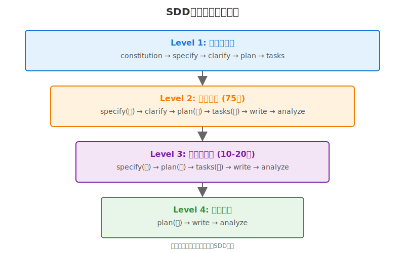

# 小说创作实战指南：SDD方法论的实践应用

## 核心理念：规格驱动创作(SDD)的本质

### 什么是规格驱动创作?

**SDD (Specification-Driven Development)** 源自软件工程,核心思想是:

> **先定义"要什么"(Spec),再决定"怎么做"(Implementation)**

传统小说创作:
```
灵感 → 直接开写 → 写到哪算哪 → 发现问题 → 大改/弃坑
```

SDD驱动创作:
```
灵感 → 规格化(specify) → 规划(plan) → 分解(tasks) → 实现(write) → 验证(analyze)
  ↑                                                                              ↓
  └──────────────────── 发现问题,回到适当层级修改规格 ──────────────────────────┘
```

### SDD的关键洞察: 不是一次性流程,而是递归循环

**❌ 错误理解: 线性流程**
```
整本书:
constitution → specify → clarify → plan → tasks → write(300章) → analyze
                                                     ↑
                                              一直在这里循环
```

**✅ 正确理解: 分层递归**
```
Level 1 - 整本书:   specify → plan → tasks
           ↓
Level 2 - 一卷:     specify → plan → tasks → write
           ↓
Level 3 - 一章:     plan → write → analyze
           ↓
Level 4 - 一段:     write
```

**每个层级都是完整的 SDD 循环!**



---

## 七步法详解


### 完整七步流程

```
1. /constitution  →  创作宪法(最高原则,不轻易改)
2. /specify       →  故事规格(单一真相源)
3. /clarify       →  澄清决策(消除歧义)
4. /plan          →  创作计划(技术方案)
5. /tasks         →  任务分解(可执行步骤)
6. /write         →  执行创作(实现)
7. /analyze       →  综合验证(质量保证)
```

### 命名空间说明

> 📝 **重要**: 不同 AI 平台使用不同的命令格式

Novel Writer 支持 13 个 AI 平台，根据 v0.15.0 的多平台优化，命令格式分为三类：

| AI 平台 | 命令格式 | 示例 |
|---------|----------|------|
| **Claude Code** | `/novel.命令名` | `/novel.constitution`, `/novel.write` |
| **Gemini CLI** | `/novel/命令名` | `/novel/constitution`, `/novel/write` |
| **其他平台** | `/命令名` | `/constitution`, `/write` |

**其他平台包括**: Cursor, Windsurf, Roo Code, GitHub Copilot, Qwen Code, OpenCode, Codex CLI, Kilo Code, Auggie CLI, CodeBuddy, Amazon Q Developer

**本文档约定**:
- 为简洁起见，示例中使用**通用格式** `/命令名`
- 使用时请根据您的 AI 平台添加相应前缀
- 例如: `/write` 在 Claude 中应输入 `/novel.write`，在 Gemini 中应输入 `/novel/write`

### 各层级如何应用七步法

| 层级 | Specify | Clarify | Plan | Tasks | Write | Analyze |
|------|---------|---------|------|-------|-------|---------|
| **整本书** | ✅ 完整 | ✅ 5个问题 | ✅ 300章 | ✅ 47任务 | - | ✅ 完结后 |
| **一卷** | ✅ 卷规格 | ✅ 卷决策 | ✅ 75章 | ✅ 卷任务 | ✅ 写章节 | ✅ 卷末 |
| **章节段** | ✅ 段规格 | - | ✅ 10章 | ✅ 10任务 | ✅ 写 | ✅ 段末 |
| **单章** | - | - | ✅ 章节大纲 | - | ✅ 写 | ✅ 写完 |

---

## 实例: 《重返1984》的SDD实践

### 项目背景

- **故事**: 18岁陈睿从2025年穿越到1984年福建龙西县
- **目标**: 120万字,300章,4卷
- **状态**: 已写7章,约28000字
- **类型**: 历史穿越+年代文+后宫向

---

## 场景1: 整本书级别的SDD (项目初始化)

### 步骤1: Constitution (创作宪法)

```bash
/constitution
```

**定义**: 《重返1984》的最高原则

```markdown
## 核心原则

### 原则1: 历史真实性与创作自由的平衡
- 1984年历史背景必须准确
- 物价、工资、政策不得出错
- 主角行动可改变个人命运,但不能轻易改变国家级历史

### 原则2: 故事驱动,拒绝炫技式穿越
- 穿越是手段,不是目的
- 先知优势有限制(大趋势记得,细节模糊)
- 每次利用未来知识必须面对困难和代价

### 原则3: 角色立体,拒绝工具人
- 每个出场人物有独立动机
- 配角不只为主角服务
- 反派有合理行为逻辑

### 原则4: 情感真实,避免悬浮
- 爱情发展必须有过程
- 友情亲情同样重要
- 情感冲突来自角色本身差异

### 原则5: 价值传递,拒绝说教
- 通过故事自然传递价值观
- 允许角色犯错、挣扎、成长
- 不回避时代局限和人性复杂
```

---

### 步骤2: Specify (故事规格)

```bash
/specify
```

**定义**: 整本书要写什么

```markdown
## 一句话故事
18岁山区少年陈睿意外穿越回1984年,用未来记忆改变自己和家人命运的成长故事

## 目标定位
- 字数: 100-150万字
- 章数: 300章
- 读者: 18-40岁,喜欢年代文和穿越文
- 类型: 历史穿越 + 年代文 + 后宫向

## 核心设定
- 主角: 陈睿,18岁,2025年穿越到1984年
- 地点: 福建龙西县(虚构,降低考据压力)
- 时间: 1984年7月-1990年代
- 先知限制: 只记得大事件和趋势,细节模糊

## 主要关系线
- 家庭线: 父母、弟弟
- 友情线: 同学、合作伙伴
- 爱情线: 青梅竹马林婉 + 大学同学江晨曦 + 其他
- 事业线: 高考 → 第一桶金 → 大学边学边商 → 创业

## 成功标准
- 逻辑一致性: 无明显漏洞
- 人物丰满度: 主角5个性格层次,主要配角3个层次
- 情节紧凑度: 每章推进主线或重要支线
```

---

### 步骤3: Clarify (关键澄清)

```bash
/clarify
```

**AI识别模糊点,提出5个关键问题**:

```
Q1: 主角对改变历史的态度?
   A) 谨慎,尽量不改变大历史
   B) 激进,想改变重大事件
   C) 随性,走一步看一步
→ 选择: A (符合原则1)

Q2: 多角情感如何处理?
   A) 三角恋冲突型
   B) 多线并行后宫型
   C) 先后顺序依次发展
→ 选择: B (后宫向定位)

Q3: 商业线侧重?
   A) 股票炒作
   B) 房地产投资
   C) 实业创业
→ 选择: C (更有戏剧性)

Q4: 第一桶金来源?
   A) 摆地摊卖磁带
   B) 倒卖紧俏商品
   C) 利用信息差做贸易
→ 选择: C (更符合主角智慧型人设)

Q5: 故事最终规模?
   A) 县城小富即安
   B) 省级商业帝国
   C) 全国级企业家
→ 选择: B (符合120万字体量)
```

**澄清结果会自动更新到specification.md**

---

### 步骤4: Plan (创作计划)

```bash
/plan
```

**基于澄清后的规格,制定技术方案**:

```markdown
## 写作方法: 英雄之旅 + 三幕结构

### 三幕结构
- 第一幕(1-75章): 穿越+适应+高考  [建立]
- 第二幕(76-225章): 大学+创业+情感+危机  [对抗]
- 第三幕(226-300章): 高潮+选择+结局  [解决]

### 第一卷详细规划(1-75章)
#### 第一部分: 穿越与适应(1-10章)
- 第1章: 穿越瞬间 [完成✓]
- 第2章: 陌生的家 [完成✓]
- 第3章: 1984年的龙西县 [完成✓]
- ...

#### 第二部分: 决心与行动(11-25章)
- 第11章: 决定改变命运
- 第12章: 测试"先知"记忆
- 第13章: 第一次赚钱尝试
- ...

#### 第三部分: 备考与成长(26-50章)
- 第26章: 进入备考状态
- 第30章: 第一桶金(中期高潮)
- 第40章: 家庭重大事件(转折)
- ...

#### 第四部分: 高考与离别(51-75章)
- 第51章: 最后冲刺
- 第70章: 高考(紧张)
- 第75章: 离开龙西(卷末高潮)
```

---

### 步骤5: Tasks (任务分解)

```bash
/tasks
```

**将plan分解为可执行任务**:

```markdown
## 准备任务 [P0 - 必须首先完成]

- [ ] T001 - 建立主角档案: 陈睿 [2小时]
  输出: characters/chen-rui.md

- [ ] T002 - 建立女角档案: 林婉 [1.5小时]
  输出: characters/lin-wan.md

- [ ] T003 - 建立女角档案: 江晨曦 [1.5小时]
  输出: characters/jiang-chenxi.md

- [ ] T004 - 建立家人档案 [1小时]
  输出: characters/family.md

- [ ] T005 - 建立龙西县设定 [3小时]
  输出: worldbuilding/longxi-county.md

- [ ] T006 - 建立1984年资料库 [4小时]
  输出: worldbuilding/1984-database.md

- [ ] T007 - 制定前50章详细大纲 [6小时]
  输出: outline/chapters-001-050.md

## 写作任务 [P1 - 正常推进]

- [x] W001 - 第1章: 穿越瞬间 [4000字] ✓
- [x] W002 - 第2章: 陌生的家 [4000字] ✓
- [x] W003 - 第3章: 1984年的龙西县 [4000字] ✓
- [x] W004 - 第4章: 记忆的碎片 [4000字] ✓
- [x] W005 - 第5章: 供销社的震撼 [4000字] ✓
- [x] W006 - 第6章: 同学聚会 [4000字] ✓
- [x] W007 - 第7章: 父母的期望 [4000字] ✓
- [ ] W008 - 第8章: 测试记忆 [4000字]
- [ ] W009 - 第9章: 第一次尝试 [4000字]
- [ ] W010 - 第10章: 意外的机会 [4000字]
```

---

### 步骤6: Write (执行创作)

```bash
/write
```

**AI会**:
1. 读取constitution.md (创作原则)
2. 读取specification.md (故事规格)
3. 读取creative-plan.md (创作计划)
4. 读取tasks.md (当前任务: W008)
5. 读取outline/chapters-001-050.md (第8章大纲)
6. 读取前7章内容 (上下文)
7. 读取validation-rules.json (角色验证规则)
8. 开始创作第8章

---

### 步骤7: Analyze (综合验证)

```bash
/track --check  # 每5-10章执行
```

**验证内容**:
```
✅ 宪法合规性: 是否违背5大原则?
✅ 规格满足度: 是否偏离specification?
✅ 情节一致性: 时间线、因果链是否合理?
✅ 角色一致性: 名字、称呼、性格是否统一?
✅ 世界观一致性: 是否出现1984年不该有的东西?
```

---

## 场景2: 一卷级别的SDD (重新规划)

### 场景描述

写完第75章(第一卷结束),发现:
- ✅ 第1-50章按计划写得不错
- ❌ 第51-75章写高考时,发现之前规划的"摆地摊卖磁带"太单薄
- ✅ 实际写成了"跟退伍军人老张做运输生意",效果更好
- 🤔 第二卷(76-150章)要不要继续运输线?

**这是一个典型的"一卷级别规格变化"**

---

### SDD应对: 对第二卷重新执行完整流程

#### 步骤1: Specify (第二卷规格)

```bash
/specify
```

**❌ 不好的提示词** (太简略):
```
第二卷要写大学和生意
```
→ 问题: 没有背景、没有具体方向、AI无法理解修改意图

**✅ 好的提示词** (结构化):


```
📝 用户输入框:

我需要重新规划第二卷(76-150章)。

【背景说明】
- 第一卷实际写成: 陈睿与老张做运输生意赚了第一桶金
- 第一卷结束: 陈睿考上厦门大学,即将入学
- 老张愿意继续合作,但需要陈睿决策

【第二卷规格调整】
1. 主线: 大学生活 + 运输生意扩大
2. 陈睿如何平衡学业与生意?
   → 大一专注学业,寒暑假参与运输
   → 大二开始边学边做
3. 运输线发展:
   → 从龙西-厦门线扩展到省内多条线
   → 从货运发展到快递雏形
4. 新角色:
   → 大学室友(3个)
   → 江晨曦(经济系同学,未来合伙人)
   → 商业对手(厦门本地运输公司)
5. 情感线:
   → 林婉在龙西(异地恋)
   → 江晨曦在厦门(逐渐靠近)

【期望输出】
请更新specification.md的"事业线"和"第二卷"相关部分。
```

**💬 完整对话流程**:

```
┌─────────────────────────────────┐
│ 👤 用户输入                      │
└─────────────────────────────────┘
/specify

[上述完整提示词]

┌─────────────────────────────────┐
│ 🤖 AI响应                        │
└─────────────────────────────────┘
我已经理解了第二卷的新方向。
让我为您更新specification.md:

【更新内容预览】
## 事业线调整

### 第一桶金(第一卷)
- 方式: 与退伍军人老张合伙做货运
- 时间: 1984年高考前
- 规模: 龙西县-厦门线,月收入约1000元
- 本金积累: 约5000元

### 大学阶段(第二卷)
- 大一上(76-90章): 专注学业,寒假回龙西帮老张
- 大一下(91-105章): 暑假参与,发现快递商机
...

是否确认更新?

┌─────────────────────────────────┐
│ 👤 用户确认                      │
└─────────────────────────────────┘
确认

┌─────────────────────────────────┐
│ 🤖 AI完成                        │
└─────────────────────────────────┘
✅ 已更新 specification.md
✅ 已更新 "事业线" 部分
✅ 已添加 "第二卷" 规格

建议下一步: /clarify (澄清第二卷的关键决策)
```

**AI输出**: 更新后的specification.md片段

```markdown
## 事业线调整

### 第一桶金(第一卷)
- 方式: 与退伍军人老张合伙做货运
- 时间: 1984年高考前
- 规模: 龙西县-厦门线,月收入约1000元
- 本金积累: 约5000元

### 大学阶段(第二卷)
- 大一上(76-90章): 专注学业,寒假回龙西帮老张
- 大一下(91-105章): 暑假参与,发现快递商机
- 大二上(106-120章): 边学边做,尝试快递雏形
- 大二下(121-135章): 遇到商业对手,竞争升级
- 卷末(136-150章): 危机与突破
```

---

#### 步骤2: Clarify (第二卷关键决策)

```bash
/clarify
```

**AI提问**:

```
Q1: 陈睿在大学的身份定位?
   A) 低调学生,生意保密
   B) 半公开,室友知道但不张扬
   C) 高调炫富,成为风云人物
→ 建议选择: B (符合主角性格+增加戏剧性)

Q2: 与林婉的异地恋走向?
   A) 稳定发展,最终修成正果
   B) 出现危机,但最终和好
   C) 渐行渐远,为江晨曦腾空间
→ 建议选择: B (增加情感线张力)

Q3: 运输生意的最终形态?
   A) 区域货运公司
   B) 省级快递网络雏形
   C) 跨省物流帝国
→ 建议选择: B (符合第二卷体量)

Q4: 商业对手的处理方式?
   A) 正面竞争,以智取胜
   B) 恶性竞争,涉及黑恶势力
   C) 最终合作,强强联合
→ 建议选择: A (符合原则2: 故事驱动)

Q5: 江晨曦的角色定位?
   A) 纯爱情线,不涉及生意
   B) 情感+合伙人双重身份
   C) 只是商业伙伴
→ 建议选择: B (多线交织更丰富)
```

---

#### 步骤3: Plan (第二卷创作计划)

```bash
/plan
```

**❌ 不好的提示词**:
```
/plan
重新规划第二卷
```

**✅ 好的提示词**:

```
📝 用户输入框:

基于更新后的第二卷规格和澄清结果,重新规划76-150章的详细方案。

【输入】
- 已更新的specification.md (第二卷规格)
- clarify的5个决策结果

【输出要求】
1. 将76-150章分为4个部分
2. 每部分包含:
   - 明确的小标题和章节范围
   - 具体到每5章的关键事件
   - 标记高潮点和转折点
3. 体现:
   - 运输线从省内到省级网络的发展
   - 陈睿从大一到大二的成长
   - 林婉(异地恋)和江晨曦(新恋情)的双线并行
   - 商业对手的竞争升级

【更新位置】
更新creative-plan.md的"第二卷"部分,保持与第一卷的衔接。
```

**AI输出**: 新的creative-plan.md第二卷部分

```markdown
## 第二卷: 大学时光(76-150章)

### 第一部分: 初入大学(76-95章)

#### 76-80章: 报到与适应
- 第76章: 告别龙西,前往厦门
- 第77章: 大学报到,初见江晨曦
- 第78章: 寝室四人组
- 第79章: 军训开始
- 第80章: 与林婉的第一次长途电话

#### 81-90章: 大一上学期
- 第81章: 专业课挑战
- 第82章: 江晨曦的学霸风采
- 第85章: 寒假前的电话(老张的困境)
- 第88章: 期末考试
- 第90章: 寒假回龙西,帮老张解决问题

#### 91-95章: 寒假龙西(小高潮)
- 第91章: 老张的危机(货被扣)
- 第92章: 陈睿利用"先知"知识解决
- 第93章: 与林婉重逢
- 第94章: 发现快递商机
- 第95章: 说服老张转型

### 第二部分: 边学边商(96-120章)

#### 96-105章: 大一下学期
- 第96章: 返校,心思不在学业
- 第98章: 与江晨曦合作完成课题
- 第100章: 暑假计划(回龙西做快递试点)
- 第105章: 期末结束,启程回龙西

#### 106-115章: 暑假快递试点
- 第106章: 快递雏形建立
- 第108章: 招聘第一批员工
- 第110章: 第一个大单(转折)
- 第112章: 遇到厦门运输公司的阻击
- 第115章: 暂时挺过,但危机埋下

#### 116-120章: 大二上学期
- 第116章: 返校,身份半公开
- 第117章: 室友的好奇与反应
- 第118章: 江晨曦提出合作
- 第119章: 陈睿的纠结(要不要拉她入伙)
- 第120章: 决定合作(转折)

### 第三部分: 竞争升级(121-135章)

#### 121-130章: 大二下学期
- 第121章: 江晨曦入股
- 第123章: 业务扩张
- 第125章: 厦门公司的恶性竞争
- 第127章: 货物被砸事件
- 第130章: 报警与博弈

#### 131-135章: 暑假危机
- 第131章: 回龙西发现老张被打
- 第132章: 调查幕后黑手
- 第133章: 与厦门公司老板谈判
- 第134章: 智斗对手
- 第135章: 危机暂解,但代价沉重

### 第四部分: 突破与选择(136-150章)

#### 136-145章: 大二结束前
- 第136章: 反思与调整
- 第138章: 引入新策略(加盟模式)
- 第140章: 业务突破
- 第143章: 林婉来厦门(情感危机)
- 第145章: 三人微妙关系

#### 146-150章: 第二卷高潮
- 第146章: 厦门公司卷土重来
- 第147章: 最后博弈
- 第148章: 以智取胜
- 第149章: 第二卷阶段性胜利
- 第150章: 大二结束,展望大三(开放式结尾)
```

---

#### 步骤4: Tasks (第二卷任务)

```bash
/tasks
```

**输入**: "基于第二卷新计划,生成76-150章的任务列表"

**AI输出**: tasks.md更新

```markdown
## 第二卷写作任务 [P1]

### 角色补充任务
- [ ] T008 - 建立老张详细档案 [1.5小时]
- [ ] T009 - 建立江晨曦详细档案 [2小时]
- [ ] T010 - 建立室友群像档案 [1.5小时]
- [ ] T011 - 建立商业对手档案 [1小时]

### 世界观补充任务
- [ ] T012 - 建立厦门大学设定 [2小时]
- [ ] T013 - 建立1985-1986年资料库 [3小时]
- [ ] T014 - 建立80年代运输/快递行业背景 [2小时]

### 大纲任务
- [ ] T015 - 制定76-100章详细大纲 [4小时]
- [ ] T016 - 制定101-125章详细大纲 [4小时]
- [ ] T017 - 制定126-150章详细大纲 [4小时]

### 写作任务
- [ ] W076 - 第76章: 告别龙西 [4000字]
- [ ] W077 - 第77章: 初见江晨曦 [4000字]
- [ ] W078 - 第78章: 寝室四人组 [4000字]
...
```

---

#### 步骤5: Write (写第二卷)

```bash
/write
```

AI会基于新的第二卷规格、计划、任务,开始创作第76章。

---

#### 步骤6: Analyze (第二卷验证)

```bash
/track --check  # 每10章
```

**第85章后验证**:
```
✅ 第76-85章是否符合第二卷新规格?
✅ 运输线发展是否合理?
✅ 江晨曦出场是否自然?
✅ 与第一卷的衔接是否流畅?
```

---

## 场景3: 章节段级别的SDD (战术调整)

### 场景描述

写到第10章时,AI写出了:
```
陈睿在县城遇到退伍军人老张,
老张看出陈睿有生意头脑,
邀请他合伙做运输生意。
```

但原计划第10章是:
```
陈睿摆地摊卖磁带,赚到第一桶钱。
```

你觉得运输线更有潜力,想保留AI的偏离。

**这是一个"章节段级别"的规格变化,影响第10-20章**

---

### SDD应对: 对第10-20章重新执行流程

#### 步骤1: Specify (第10-20章小规格)

```bash
/specify
```

**❌ 不好的提示词** (太模糊):
```
第10章写偏了,我想改一下
```
→ 问题: 没说怎么偏了,想怎么改,影响多少章

**✅ 好的提示词** (明确范围):

```
📝 用户输入框:

【情况说明】
第10章AI写出了"运输线"(陈睿遇到老张,合伙做运输),
但原计划是"摆地摊卖磁带"。

我觉得运输线更有潜力,想保留这个偏离。

【影响范围】
第10-20章需要重新规划(约10章,4万字)

【新规格】
- 第10章: 遇到老张,决定合伙做运输 [已写✓]
- 第11-13章: 学习运输行业,第一次跑长途
- 第14-16章: 生意起步,遇到竞争对手
- 第17-19章: 解决初期困难
- 第20章: 赚到第一桶金(约5000元)

【需要更新】
1. 更新specification.md:
   - "第一桶金"来源: 从"摆地摊卖磁带"改为"运输生意"

2. 新增角色设定:
   - 老张: 退伍军人,40岁,有货车,需要合伙人
   - 与主角关系: 师徒+合伙人

3. 说明平衡:
   - 运输线如何不影响高考备考?
   - 陈睿周末和假期参与,平时专心学习

【不影响的部分】
- 第1-9章保持不变
- 第21-30章的高考备考线继续
- 家庭线、青梅竹马线不受影响
```

**💬 完整对话流程**:

```
┌─────────────────────────────────┐
│ 👤 用户输入                      │
└─────────────────────────────────┘
/specify

[上述完整提示词]

┌─────────────────────────────────┐
│ 🤖 AI响应                        │
└─────────────────────────────────┘
我理解了!第10章的运输线偏离是个好机会。

让我为您:
1. 更新specification.md的"第一桶金"部分
2. 创建老张的角色档案
3. 说明运输线与高考的平衡

【更新预览】
## 第一桶金(调整)
- 原: 摆地摊卖磁带,赚取约3000元
- 新: 与退伍军人老张合伙做运输,赚取约5000元
- 时间: 1984年高考前两个月
- 参与方式: 周末和假期参与,平时专心备考

## 新增角色: 老张
- 姓名: 张国庆
- 年龄: 40岁
- 身份: 退伍军人,个体运输户
- 性格: 耿直豪爽,讲义气
- 与主角: 初期是师傅,后期是合伙人

是否确认更新?

┌─────────────────────────────────┐
│ 👤 用户确认                      │
└─────────────────────────────────┘
确认

┌─────────────────────────────────┐
│ 🤖 AI完成                        │
└─────────────────────────────────┘
✅ 已更新 specification.md
✅ 已创建 characters/zhang-guoqing.md
✅ 已调整 "第一桶金" 来源

建议下一步: /clarify (澄清第10-20章的3个关键决策)
```

**AI输出**: 更新specification.md和增加老张角色档案

---

#### 步骤2: Clarify (第10-20章决策)

```bash
/clarify
```

**AI提问**:
```
Q1: 老张的角色深度?
   A) 工具人,只是帮主角赚钱
   B) 重要配角,有自己的故事线
   C) 后续主要合伙人,深度参与
→ 建议: B

Q2: 运输线如何不影响高考备考?
   A) 陈睿很快抽身,让老张独立经营
   B) 陈睿周末和假期参与,平时备考
   C) 陈睿放弃高考,全身心投入
→ 建议: B (符合主角理智人设)

Q3: 第一桶金的具体数额?
   A) 3000元(保守)
   B) 5000元(合理)
   C) 10000元(过高,不真实)
→ 建议: B
```

---

#### 步骤3: Plan (第10-20章详细规划)

```bash
/plan
```

**输入**: "重新规划第10-20章,围绕运输线展开"

**AI输出**: 新的outline

```markdown
### 第10-20章: 运输生意线(新)

#### 第10章: 意外的机会 [已写✓]
- 陈睿县城遇老张
- 老张邀请合伙做运输
- 陈睿权衡后同意

#### 第11章: 学习行业规则
- 跟老张学习运输流程
- 了解1984年个体运输政策
- 第一次去货运站

#### 第12章: 第一次跑长途
- 陈睿跟车去厦门
- 路上见闻(80年代公路、检查站)
- 体会赚钱不易

#### 第13章: 初尝甜头
- 第一单赚了200元
- 陈睿分到100元
- 兴奋与思考

#### 第14章: 遇到麻烦
- 货物被扣(没有齐全手续)
- 陈睿利用"先知"知识解决
- 老张刮目相看

#### 第15章: 生意起步
- 确立合伙模式(三七分,老张七陈睿三)
- 陈睿提出改进方案
- 业务逐渐稳定

#### 第16章: 竞争对手出现
- 另一个运输队抢生意
- 价格战
- 陈睿献策:服务差异化

#### 第17章: 小有名气
- 口碑传开,生意变好
- 陈睿在县城小有名气
- 父母态度转变(担心→默许)

#### 第18章: 平衡学业
- 高考临近,陈睿减少参与
- 老张理解并支持
- 陈睿给老张留下发展建议

#### 第19章: 一次危机
- 老张出车祸(轻伤)
- 陈睿顶上,独立完成一单
- 证明自己能力

#### 第20章: 第一桶金
- 算账:两个月赚了5000元
- 陈睿决定用3000元做高考后的本金
- 2000元留给老张周转
- 专心备考
```

---

#### 步骤4: Tasks (第10-20章任务)

```bash
/tasks
```

**AI输出**: tasks.md更新

```markdown
## 章节段任务调整

### 删除原任务
- ~~W010 - 第10章: 摆地摊卖磁带~~
- ~~W011-W015 - 磁带销售线~~

### 新增任务
- [x] W010 - 第10章: 意外的机会(运输线) ✓
- [ ] T008 - 建立老张角色档案 [1小时]
- [ ] W011 - 第11章: 学习行业规则 [4000字]
- [ ] W012 - 第12章: 第一次跑长途 [4000字]
- [ ] W013 - 第13章: 初尝甜头 [4000字]
- [ ] W014 - 第14章: 遇到麻烦 [4000字]
- [ ] W015 - 第15章: 生意起步 [4000字]
- [ ] W016 - 第16章: 竞争对手 [4000字]
- [ ] W017 - 第17章: 小有名气 [4000字]
- [ ] W018 - 第18章: 平衡学业 [4000字]
- [ ] W019 - 第19章: 一次危机 [4000字]
- [ ] W020 - 第20章: 第一桶金 [4000字]
```

---

#### 步骤5: Write (写第11-20章)

```bash
/write
```

AI基于新规划,继续写第11章。

---

#### 步骤6: Analyze (第10-20章验证)

```bash
/track --check  # 第20章后
```

**验证**:
```
✅ 第10-20章运输线是否自洽?
✅ 时间线是否合理(高考前两个月能赚5000元吗)?
✅ 老张这个角色是否立体?
✅ 与第1-9章的衔接是否流畅?
✅ 为第21-30章备考线留下空间了吗?
```

---

## 场景4: 单章级别的SDD (最小粒度)

### 场景描述

第5章"供销社的震撼"写完后,觉得质量不满意:
- 环境描写太流水账
- 缺少时代冲击力
- 主角情感不够饱满

**这是单章级别的质量问题,需要重写**

---

### SDD应对: 对第5章重新执行

#### 步骤1: Plan (第5章新方案)

```bash
/write
```

**选择**: 改写现有章节 → 第5章

**❌ 不好的提示词** (太笼统):
```
第5章写得不好,重写
```
→ 问题: 没说哪里不好,怎么改

**✅ 好的提示词** (问题明确+方向清晰):

```
📝 用户输入框:

【选择】改写现有章节 → 第5章

【原章节问题】
1. 环境描写流水账,缺少细节和氛围
2. 没有展现1984年供销社的时代冲击
3. 陈睿的情感不够饱满,震撼感不足
4. 章末钩子弱,吸引力不够

【改进方向】

1. 增加时代细节场景:
   - 供销社玻璃柜台(隔着玻璃看商品)
   - 营业员的态度(不是"顾客是上帝")
   - "凭票供应"牌子醒目
   - 顾客排队买东西的压抑氛围
   - 货架上商品种类少、数量少

2. 增加冲突事件(增强戏剧性):
   - 陈睿看到有人因没粮票买不到面粉,求营业员通融被拒
   - 看到小孩子眼巴巴盯着罐头罐(买不起)
   - 对比2025年超市的丰富多样
   - 陈睿内心震撼: 原来贫困是这样真实

3. 增强情感层次:
   - 震撼: 1984年的物质匮乏超出想象
   - 心疼: 看到穷人连面粉都买不起
   - 愧疚: 2025年的自己浪费了多少
   - 决心: 一定要让家人过上好日子
   - 思考: 我能用先知知识改变什么?

4. 章末钩子加强:
   - 陈睿听到两个人讨论"万元户"
   - 或者遇到未来的关键人物(老师/商人)
   - 埋下伏笔: 为第10章赚钱线做铺垫

【约束条件】
- 字数: 4000字左右
- 风格: 符合constitution的"细节塑造氛围"原则
- 衔接: 与第4章、第6章内容连贯
- 时间: 保持在1984年7月某一天

【期望效果】
读者能通过第5章感受到1984年的真实生活,
理解陈睿为什么要改变命运。
```

**💬 完整对话流程**:

```
┌─────────────────────────────────┐
│ 👤 用户输入                      │
└─────────────────────────────────┘
/write

选择: 改写现有章节
选择章节: 第5章

[上述完整提示词]

┌─────────────────────────────────┐
│ 🤖 AI响应                        │
└─────────────────────────────────┘
明白了!我将重写第5章,重点增强时代氛围和情感冲击。

让我先读取相关文件:
✓ 第4章内容(确保衔接)
✓ 第6章内容(确保连贯)
✓ constitution.md(风格原则)
✓ 1984-database.md(供销社细节)

开始重写第5章...

[AI生成4000字新内容]

【重写要点】
- 增加供销社玻璃柜台、凭票供应的具体描写
- 增加因没粮票买不到面粉的冲突事件
- 增强陈睿内心震撼和决心的情感层次
- 章末加入"万元户"讨论,为后续赚钱线铺垫

是否确认替换第5章?

┌─────────────────────────────────┐
│ 👤 用户确认                      │
└─────────────────────────────────┘
确认

┌─────────────────────────────────┐
│ 🤖 AI完成                        │
└─────────────────────────────────┘
✅ 已重写 chapter-005.md
✅ 字数: 4012字
✅ 已验证与第4、6章的衔接

建议: /plot-check 验证第5章改写后的情节连贯性
```

---

#### 步骤2: Write (重写第5章)

AI会:
1. 读取constitution (风格原则)
2. 读取第4章和第6章 (确保衔接)
3. 读取outline对第5章的要求
4. 读取1984-database.md (供销社细节)
5. 应用新方案重写

---

#### 步骤3: Analyze (验证第5章)

```bash
/plot-check  # 单章验证
```

**验证**:
```
✅ 第4章 → 第5章 → 第6章 情节连贯?
✅ 陈睿的心理转变自然?
✅ 时代细节准确?
✅ 字数符合4000左右?
✅ 章末钩子是否有效?
```

---

## SDD方法论的灵活应用

### 何时执行哪个层级的SDD?

#### 决策树

```
需要修改?
    ↓
影响整本书的核心设定? (如:主角性格大改、故事类型变化)
    ├─ 是 → 整本书级别SDD (specify → plan → tasks)
    └─ 否 ↓

影响一整卷的结构? (如:一卷的主线改变)
    ├─ 是 → 一卷级别SDD (specify卷 → plan卷 → tasks卷)
    └─ 否 ↓

影响10-30章的情节? (如:某条支线改变)
    ├─ 是 → 章节段级别SDD (plan段 → tasks段 → write)
    └─ 否 ↓

只是某章质量不满意? (如:文字不够精彩)
    └─ 是 → 单章级别SDD (write重写 → analyze验证)
```

---

### 实例: 《重返1984》的决策案例

| 变化类型 | 影响范围 | SDD层级 | 命令流程 |
|---------|---------|---------|---------|
| 想把主角从"低调"改为"高调" | 整本书 | 整本书级别 | /constitution → /specify → /plan → /tasks |
| 第二卷商业线从"摆摊"改为"运输" | 一卷(76-150章) | 一卷级别 | /specify(卷) → /plan(卷) → /tasks(卷) |
| 第10-20章从"卖磁带"改为"运输" | 章节段(10章) | 章节段级别 | /specify(段) → /plan(段) → /tasks(段) |
| 第5章重写,增加细节 | 单章 | 单章级别 | /write(重写) → /analyze |
| 林秀珍性格从"保守"改为"开明" | 角色设定 | 整本书级别 | /specify(角色) → /write(改写涉及章节) |
| 增加老张这个角色 | 新增角色 | 章节段级别 | /specify(角色) → /plan(涉及章节) |

---

### 频繁验证的重要性

#### 验证频率建议

| 粒度 | 验证时机 | 命令 | 检查内容 |
|------|---------|------|---------|
| **规格完成后** | 写作前 | `/checklist 规格完整性` | 规格文档质量 |
| **计划完成后** | 写作前 | `/checklist 大纲质量` | 计划文档质量 |
| **每章写完** | 立即 | AI自动 | 角色名、基本逻辑 |
| **每5-10章** | 阶段性 | `/track --check` + `/checklist 人物一致性` | 时间线、关系、世界观、内容质量 |
| **完成一卷** | 卷末 | 全面验证 | `/plot-check` `/timeline` `/relations` `/world-check` |
| **完成全书** | 完结 | 最终审核 | `/analyze` 综合质量 |

#### 实例: 《重返1984》的验证计划

```bash
# 写作前：规格验证
/specify
/checklist 规格完整性
- ✅ 确保 specification.md 质量合格
/plan
/checklist 大纲质量
- ✅ 确保 creative-plan.md 质量合格

# 第10章后 (第一部分完成)
/track --check
/checklist 人物一致性 1-10
- 检查第1-10章的角色一致性
- 检查时间线(1984年7月的10天)
- 检查世界观细节(粮票、工资等)
- 扫描人物描写质量

# 第25章后 (第二部分完成)
/track --check
/plot-check
/checklist 情节逻辑 11-25
- 检查第11-25章的情节推进
- 检查运输线的逻辑
- 检查伏笔埋设
- 验证情节合理性

# 第50章后 (第三部分完成)
/track --check
/timeline
/relations
/checklist 时间线 26-50
- 检查第26-50章的时间跨度
- 检查角色关系发展
- 检查家庭线、友情线
- 验证时间线一致性

# 第75章后 (第一卷完成)
完整验证:
/track --check
/plot-check
/timeline
/relations
/world-check
/checklist 宪法合规 1-75
/analyze
- 全面检查第一卷的质量
- 验证是否符合创作宪法
- 为第二卷规划做准备
```

---

## 追踪系统如何支持SDD

### /track-init: 建立追踪数据

```bash
/track-init
```

**作用**: 基于已有内容初始化追踪系统

**《重返1984》实例**:
```
扫描已写的7章,生成:
- validation-rules.json
  ↳ 陈睿、林秀珍、陈国强等角色规则
- plot-tracker.json
  ↳ 第1-7章情节节点
- timeline.json
  ↳ 1984年7月的时间线
- character-state.json
  ↳ 陈睿@龙西县矿区、林秀珍@家中
- relationships.json
  ↳ 陈睿-林秀珍(母子)、陈睿-陈国强(父子)
```

---

### /track: 查看当前状态

```bash
/track              # 完整报告
/track --brief      # 简要信息
/track --stats      # 统计数据
```

**实例输出**:
```
📊 《重返1984》创作报告
━━━━━━━━━━━━━━━━━━━
✍️ 写作进度
  完成: 7/300章 (2.3%)
  字数: 28,000/1,200,000
  当前: 第一卷第一部分

📍 情节状态
  主线: 穿越适应 [进行中]
  支线: 家庭关系 [活跃]

⏰ 时间线
  故事时间: 1984年7月
  时间跨度: 10天

👥 角色状态
  陈睿: 龙西县矿区
  林秀珍: 活跃
  陈国强: 活跃

⚡ 待处理
  下一章: 第8章
  伏笔: 1个(穿越原因)
```

---

### /track --check: 深度验证

```bash
/track --check
```

**《重返1984》实例**:
```
🔍 深度验证报告(第1-7章)
━━━━━━━━━━━━━━━━━━━

✅ 通过项目: 18/20

❌ 发现问题 (2):
1. [低] 第3章: "林秀珍"第一次出现未介绍身份
2. [低] 第6章: 时间描述"昨天"不明确

建议:
- 第3章补充: "母亲林秀珍"
- 第6章明确: "7月X日"

自动修复: 2个问题可修复
运行 /track --fix 修复
```

---

### /track --fix: 自动修复

```bash
/track --fix
```

**《重返1984》实例**:
```
🔧 自动修复报告
━━━━━━━━━━━━━━━

✅ 已修复: 2个问题
- 第3章: 补充"母亲林秀珍"
- 第6章: "昨天" → "7月15日"

修复完成!建议重新运行 /track --check 验证
```

---

### /checklist: 质量检查清单 (v0.16.0 新增)

**双保险机制**: 像软件的"单元测试"一样，为创作文档建立质量门槛。

#### 第一类: 规格质量检查（写作前）

```bash
/checklist 大纲质量
```

**用途**: 验证 specification.md、creative-plan.md 等文档质量

**《重返1984》实例**:
```
📋 大纲质量检查清单
━━━━━━━━━━━━━━━━━

✅ 完整性 (5/5)
  ✓ 故事规格包含一句话故事
  ✓ 目标定位明确（字数、章数、读者）
  ✓ 核心设定完整（主角、地点、时间）
  ✓ 主要关系线已定义
  ✓ 成功标准可衡量

✅ 清晰度 (4/5)
  ✓ 每个章节段有明确关键事件
  ✓ 高潮点和转折点已标记
  ✓ 线索管理表完整
  ⚠️ 第50-75章细节不足（建议补充）

✅ 一致性 (5/5)
  ✓ 时间线前后一致
  ✓ 角色设定无矛盾
  ✓ 世界观规则统一

⚠️ 建议改进:
1. [P1] 补充第50-75章的具体事件
2. [P2] 增加第二卷的线索交汇点规划

生成文件: spec/checklists/outline-quality.md (覆盖模式)
```

#### 第二类: 内容验证检查（写作后）

```bash
/checklist 人物一致性 1-10
```

**用途**: 扫描已写章节，检查内容质量

**《重返1984》实例**:
```
📋 人物一致性检查(第1-10章)
━━━━━━━━━━━━━━━━━━━━━

✅ 通过项 (18/20)

❌ 发现问题 (2):
1. [中] 第3章: 陈睿对1984年的震惊程度与第1章不一致
   - 第1章: 非常震惊
   - 第3章: 表现得很适应
   建议: 统一震惊到适应的过渡节奏

2. [低] 第7章: 林婉的性格描述与第5章略有差异
   - 第5章: "活泼开朗"
   - 第7章: "内向害羞"
   建议: 确定林婉的核心性格

💡 改进建议:
- 复查第3章，增加适应过程的描写
- 统一林婉的性格设定（建议修改第7章）

生成文件: spec/checklists/character-consistency-20251011.md (带日期)
```

#### 五种检查类型

**规格质量检查（写作前）**:
1. `/checklist 大纲质量` - 检查 outline/creative-plan.md
2. `/checklist 规格完整性` - 检查 specification.md
3. `/checklist 世界观一致性` - 检查 worldbuilding/*.md
4. `/checklist 角色档案` - 检查 characters/*.md
5. `/checklist 线索规划` - 检查 specification.md 第五章

**内容验证检查（写作后）**:
1. `/checklist 人物一致性 1-10` - 扫描第1-10章
2. `/checklist 情节逻辑 1-20` - 扫描第1-20章
3. `/checklist 时间线 1-30` - 扫描第1-30章
4. `/checklist 对话风格 5-15` - 扫描第5-15章
5. `/checklist 宪法合规 1-50` - 扫描第1-50章

#### 使用时机

```
写作前验证流程:
/specify → /checklist 规格完整性 → /plan → /checklist 大纲质量 → /tasks → /write
    ↑                                                                       ↓
    └──────────────── 发现规格问题，立即修复 ────────────────────────────┘

写作后验证流程:
/write (写完10章) → /checklist 人物一致性 1-10 → 发现问题 → 修复 → 继续
```

---

## 总结: SDD的核心价值

### 1. 规格是单一真相源

**传统方式**:
```
脑子里的想法 ≠ 已写的内容 ≠ 后续的计划
→ 混乱、不一致、大量返工
```

**SDD方式**:
```
specification.md = 唯一权威
    ↓
creative-plan.md = specification的实现方案
    ↓
tasks.md = plan的分解
    ↓
content/*.md = tasks的执行结果
    ↓
所有修改都回溯到specification
```

---

### 2. 分层递归是核心

**不是**:
```
specify一次 → 一直write到完结
```

**而是**:
```
整本书: specify → plan → tasks
   ↓
每一卷: specify → plan → tasks → write → analyze
   ↓              ↑_________________________|
每一段: plan → write → analyze
   ↓         ↑____________|
每一章: write
```

---

### 3. 允许偏离,但要同步规格

**偏离发生时**:
```
AI写出了不在计划中的情节
    ↓
评估: 是否比原计划更好?
    ↓
好 → 保留 → 立即更新上游规格
    ↓
specification → plan → tasks 保持一致
    ↓
继续写,AI基于新规格
```

**《重返1984》实例**:
```
第10章AI写出"运输线" (不在原计划)
    ↓
评估: 运输线比摆地摊更有戏剧性 ✓
    ↓
更新specification: "第一桶金来自运输"
更新plan: 第10-20章围绕运输
更新tasks: W011-W020改为运输任务
    ↓
继续写第11章,AI知道"运输"是正确路线
```

---

### 4. 频繁验证防止累积错误

**传统方式**:
```
写100章 → 发现前50章有bug → 大规模返工
```

**SDD方式**:
```
每5-10章验证 → 发现小问题 → 小修复 → 继续
    ↓
每一卷验证 → 发现结构问题 → 调整下一卷规划
    ↓
完结验证 → 最终打磨
```

---

## 附录: 命令速查表

> 💡 **命名空间提示**: 表中使用通用格式，实际使用时：
> - Claude Code 添加 `novel.` 前缀（如 `/novel.write`）
> - Gemini CLI 添加 `novel/` 前缀（如 `/novel/write`）
> - 其他平台直接使用（如 `/write`）

### 七步方法论命令

| 命令 | 层级 | 用途 | 《重返1984》实例 |
|------|------|------|-----------------|
| `/constitution` | 全局 | 创作宪法 | 5大原则(历史真实性等) |
| `/specify` | 可变 | 规格定义 | 整本/一卷/一段的规格 |
| `/clarify` | 可变 | 澄清决策 | 5个关键问题 |
| `/plan` | 可变 | 创作计划 | 整本/一卷/一段的规划 |
| `/tasks` | 可变 | 任务分解 | 47个任务(准备+写作) |
| `/write` | 执行 | 写作 | 写第8章/重写第5章 |
| `/analyze` | 验证 | 综合验证 | 智能双模式(框架/内容) |

### 追踪与验证命令

| 命令 | 层级 | 用途 | 《重返1984》实例 |
|------|------|------|-----------------|
| `/track-init` | 初始化 | 初始化追踪系统 | 基于7章生成追踪数据 |
| `/track` | 追踪 | 进度查看 | 随时查看 |
| `/track --check` | 验证 | 深度验证 | 每5-10章 |
| `/track --fix` | 修复 | 自动修复 | 发现问题后 |
| `/checklist` | 验证 ⭐ | 质量检查清单 | 规格质量(写作前) + 内容验证(写作后) |
| `/plot-check` | 验证 | 情节检查 | 单独情节验证 |
| `/timeline` | 验证 | 时间线检查 | 时间逻辑验证 |
| `/relations` | 验证 | 关系检查 | 角色关系验证 |
| `/world-check` | 验证 | 世界观检查 | 设定一致性验证 |

### 辅助命令

| 命令 | 层级 | 用途 | 《重返1984》实例 |
|------|------|------|-----------------|
| `/expert` | 咨询 | 专家建议 | 遇到难题时 |

---

## 六、多线索管理指南

### 6.1 问题场景

**网友的真实困惑**:
> "主线和支线的穿插,很难给AI讲清楚如何保持并行,而且在适当的时候进行交叉和揭晓之前的线索。尤其是再剧情设定不定时修改的情况下,简直就是灾难。"

**三个核心痛点**:
1. **并行推进**: AI不知道这一章要推进哪些线索
2. **交汇时机**: AI随意发挥,交汇点不受控
3. **修改后的一致性**: 改了一处,其他地方全乱套

### 6.2 解决方案:无需新增命令

**核心思路**: 在现有的`/specify` → `/plan` → `/tasks` → `/track`流程中,增强**线索管理**能力。

#### 第一步:`/specify` - 定义所有线索

在`specification.md`新增**第五章:线索管理规格**,包含5个表格:

**5.1 线索定义表** - 定义所有线索的ID、类型、冲突:
```markdown
| 线索ID | 线索名称 | 类型 | 优先级 | 起止章节 | 核心冲突 |
|-------|---------|------|--------|---------|---------|
| PL-01 | 家庭线 | 主线支撑 | P0 | 1-300 | 贫困vs改变命运 |
| PL-02 | 爱情线-林婉 | 主线 | P0 | 5-270 | 纯真vs现实 |
```

**5.2 线索节奏规划** - 规划每条线索在不同卷的活跃度:
```markdown
| 线索ID | 第一卷 | 第二卷 | 第三卷 | 第四卷 |
|-------|--------|--------|--------|--------|
| PL-01 | ⭐⭐⭐ 活跃 | ⭐⭐ 中等 | ⭐ 背景 | ⭐⭐⭐ 活跃 |
```

**5.3 线索交汇点规划** - 预先规划交汇时机(避免AI随意):
```markdown
| 交汇点ID | 章节 | 涉及线索 | 交汇内容 | 预期效果 |
|---------|------|---------|---------|---------|
| X-001 | 40 | PL-01+PL-02 | 第一次赚钱帮助家里,林婉感激 | 两条线交汇,情感升温 |
```

**5.4 伏笔管理表** - 管理伏笔埋设与揭晓:
```markdown
| 伏笔ID | 埋设章节 | 涉及线索 | 内容 | 揭晓章节 |
|-------|---------|---------|------|---------|
| F-001 | 5 | PL-01+PL-02 | 林婉家困难 | 40 |
```

**5.5 线索修改决策矩阵** - 修改某条线索时的影响检查清单。

#### 第二步:`/plan` - 标注每章节段的活跃线索

在`creative-plan.md`的章节段表格增加"活跃线索"和"交汇点"列:

```markdown
| 章节段 | 内容 | 关键事件 | **活跃线索** | **交汇点** |
|--------|------|---------|-------------|-----------|
| 1-10章 | 穿越与适应 | ... | PL-01⭐⭐⭐ | 无 |
| 11-25章 | 决心与行动 | ... | PL-01⭐⭐、PL-02⭐⭐⭐ | 无 |
| 26-50章 | 备考与成长 | ... | PL-01⭐⭐、PL-02⭐、PL-03⭐⭐⭐ | X-001(40章) |
```

#### 第三步:`/tasks` - 为每章标注涉及线索

在`tasks.md`每个写作任务增加"涉及线索"字段:

```markdown
- [ ] **W040** - 第40章：第一桶金
  - **核心任务**：陈睿第一次赚到大钱
  - **涉及线索**：
    - PL-01(家庭线) ⭐⭐⭐ 主推进
    - PL-02(爱情线-林婉) ⭐⭐ 辅助
  - **交汇点**：X-001(家庭+爱情)
  - **伏笔揭晓**：F-001(帮助林婉家)
  - **必须包含**：赚钱、帮助家人、林婉感激、情感升温
```

#### 第四步:`/track --init` - 自动生成追踪

运行`/track --init`时,从specification.md第五章自动填充`plot-tracker.json`:

```json
{
  "plotlines": {
    "subplots": [
      {
        "id": "PL-01",
        "name": "家庭线",
        "status": "active",
        "upcomingNodes": [
          {"chapter": 40, "node": "第一次帮助家庭(X-001)"}
        ]
      }
    ]
  },
  "intersections": [
    {"id": "X-001", "chapter": 40, "plotlines": ["PL-01", "PL-02"]}
  ]
}
```

### 6.3 使用示例:《重返1984》

#### 示例1: 初次规划多线索

```bash
/specify

📝 用户输入:
【情况说明】
《重返1984》有5条线索:家庭线、友情线、爱情线(林婉)、爱情线(江晨曦)、事业线。
当前specification.md缺少线索管理规格。

【修改意图】
在specification.md新增第五章,定义5条线索的ID、节奏、7个交汇点、5个伏笔。

【需要更新】
- specification.md:新增第五章

【期望输出】
包含完整线索管理规格的specification.md v1.2.0
```

AI会生成包含5个表格的第五章,明确所有线索的规划。

#### 示例2: 写作时推进线索

```bash
/write 第40章

📝 用户输入:
【情况说明】
第40章是交汇点X-001(家庭线+爱情线),需要揭晓伏笔F-001。

【写作意图】
本章涉及3条线索:
- PL-05(事业线)⭐⭐⭐:赚到第一桶金
- PL-01(家庭线)⭐⭐⭐:拿钱回家
- PL-02(爱情线-林婉)⭐⭐:帮助林婉家

【必须完成】
1. 写出赚钱过程(事业线高潮)
2. 父母震惊感动(家庭线深化)
3. 帮助林婉家揭晓F-001(爱情线推进)
4. 两条线交汇,情感升温

【期望输出】
4000字章节 + 自动更新plot-tracker.json
```

#### 示例3: 修改线索后的影响评估

```bash
/specify

📝 用户输入:
【情况说明】
原计划林婉在第150章来城市,现在想提前到第100章。

【修改意图】
调整PL-02(林婉线):
1. 交汇点X-004从150章改为100章
2. 第二卷林婉线活跃度从⭐⭐改为⭐⭐⭐

【影响评估】
根据5.5修改决策矩阵,检查影响:
- 5.2节:第二卷节奏调整
- 5.3节:X-004提前
- 5.4节:F-002可能需要提前埋设
- creative-plan.md:96-150章章节段需要调整
- tasks.md:W096-W150任务需要重新规划

【需要更新】
- specification.md 5.2、5.3节
- 输出影响评估报告

【期望输出】
更新后的specification.md + 影响范围清单
```

然后根据影响评估,依次运行`/plan`和`/tasks`同步修改。

#### 示例4: 验证多线索一致性

```bash
/track --check

📝 用户输入:
【情况说明】
已写完前50章,需要验证多线索进展是否符合规划。

【检查内容】
1. 所有线索是否按spec 5.2节的节奏推进?
2. 交汇点X-001(40章)是否已完成?
3. 伏笔F-001是否已揭晓?
4. 是否有线索休眠超过20章?

【期望输出】
一致性检查报告:
- ✅ 已完成的线索节点
- ⚠️ 偏离规划的内容
- ❌ 遗漏的交汇点或伏笔
- 💡 建议
```

### 6.4 解决三大痛点

| 痛点 | 解决方式 | 具体文件 |
|------|---------|---------|
| **并行推进** | tasks.md每章标记"涉及线索" | W040任务标注PL-01⭐⭐⭐、PL-02⭐⭐ |
| **交汇时机** | specification.md 5.3节预先规划 | X-001定在40章,避免AI随意 |
| **修改一致性** | 5.5修改决策矩阵 + `/track --check` | 修改PL-02时,自动提示影响范围 |

### 6.5 核心优势

✅ **无需新增命令** - 完全使用现有7个命令
✅ **符合SDD方法论** - 线索管理分布在specify→plan→tasks→track
✅ **有写作理论支撑** - Story Grid的Grid Spreadsheet、Save the Cat的B Story理念
✅ **解决真实痛点** - 来自网友的实际需求

---

## 最后的话

**SDD方法论不是教条,而是赋能工具**

它帮助你:
- ✅ 将模糊灵感转化为清晰作品
- ✅ 在偏离发生时快速调整
- ✅ 保持不同粒度的规格一致
- ✅ 管理复杂的多线索创作
- ✅ 持续产出高质量内容

**记住核心**:
> 规格驱动 + 分层递归 + 允许偏离 + 频繁验证

**《重返1984》的成功经验**:
- 明确的constitution (5大原则)
- 清晰的specification (120万字目标+5条线索规划)
- 灵活的plan调整 (允许线索偏离)
- 有效的追踪验证 (7章保持高质量)

祝你用SDD方法论创作出精彩的作品!

---

*"专业始于方法,卓越源于坚持。"*